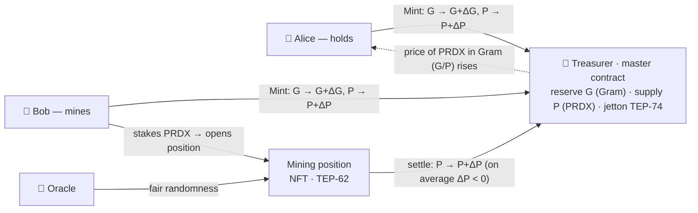
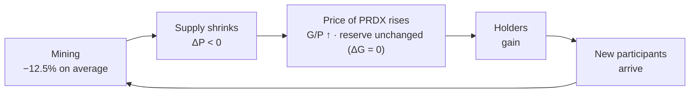
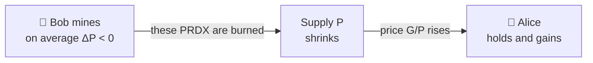
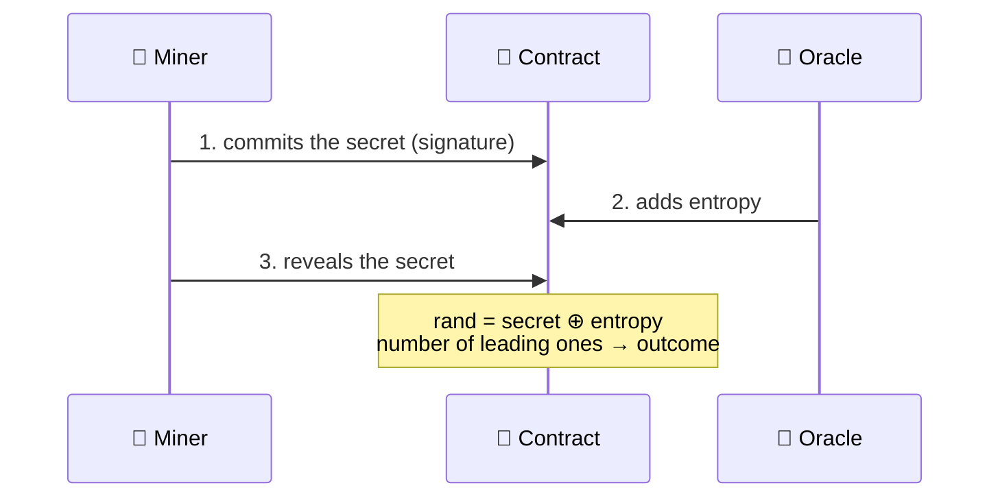
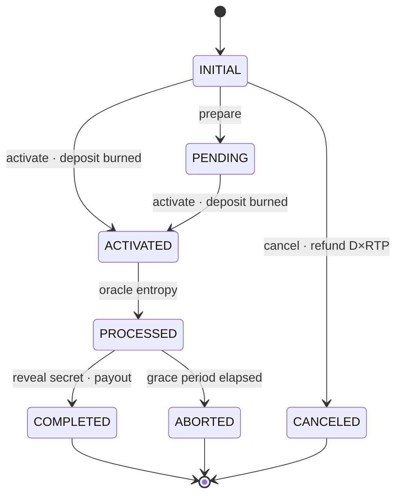

# PARADOX (PRDX)

> 🌐 **[Русская версия](../ru/docs.md)**

**PRDX is the world's first mathematical token: its price is set by a formula, not by the market.**

In short: PRDX is a **digital token** (jetton) on the TON network that is **not traded on exchanges** — no speculation, no market swings. Every token is **100% backed by Gram**, like a gold standard 🥇. And **mining** is the heart of the protocol: a built-in mechanism with open, predefined rules that grows the price for holders and gives a chance to multiply tokens.

    

| Contract | Address |
|----------|---------|
| [Paradox Master](https://testnet.tonviewer.com/kQAi9ONGfiP28aeqJW6hAWh54r9LLvFUYbr9ViYfAuaLi2UO) [TESTNET] | EQAi9ONGfiP28aeqJW6hAWh54r9LLvFUYbr9ViYfAuaLi96E |

> ⚠️ **Testnet stage.** PARADOX is deployed on the TON testnet. All operations use test Gram, which has **no real value**. Do not send mainnet Gram or real funds to the protocol.

---

## Contents

**Understand in a minute**

- [1. The Big Picture](#1-the-big-picture)
- [2. Foundation: The St. Petersburg Paradox](#2-foundation-the-st-petersburg-paradox)
- [3. Two Strategies: Alice and Bob](#3-two-strategies-alice-and-bob)

**How it works**

- [4. The Treasurer and the Rate](#4-the-treasurer-and-the-rate)
- [5. Mint and Burn](#5-mint-and-burn-exchanging-gram-and-prdx)
- [6. Mine](#6-mine-the-game-that-creates-value)
- [7. The Oracle and Provable Fairness](#7-the-oracle-and-provable-fairness)
- [8. Position Lifecycle (NFT)](#8-position-lifecycle-nft)

**Reference**

- [9. Parameters and Notation](#9-parameters-and-notation)
- [10. Technical Specification](#10-technical-specification)

**Practice**

- [11. Getting Started](#11-getting-started)
- [12. Risks](#12-risks)
- [13. FAQ and Glossary](#13-faq-and-glossary)

---

## 1. The Big Picture

**TL;DR** — *Alice and Bob deposit Gram (**ΔG**) into the protocol and receive PRDX. Bob mines: he stakes some of his PRDX, and the protocol turns it into a new amount by open rules and fair randomness — sometimes more, sometimes less. On average a miner ends up slightly down, so the PRDX supply (**P**) shrinks, and with the Gram reserve (**G**) unchanged the price of PRDX rises.*

The whole protocol can be described through four characters:

- 👩 **Alice** — the cautious holder: buys PRDX and holds.
- 👨 **Bob** — the active participant: uses mining to try to increase his PRDX.
- 🏦 **The Treasurer** — the protocol's smart contract. It holds the Gram reserve, mints and burns PRDX, and tracks just two quantities: **G** — how much Gram is in reserve, and **P** — how much PRDX is issued.
- 🎲 **The Oracle** — the source of fair randomness that mining is built on.

### How it works

**Issuance.** To get PRDX, Alice and Bob deposit some amount of Gram into the contract — call it **ΔG**; in return the Treasurer mints new PRDX at the current rate, and *both* records increase: reserve **G → G + ΔG** and supply **P → P + ΔP**. The reverse is also available: by returning PRDX you reclaim your share of Gram — the returned PRDX is **burned** 🔥, and both records decrease by their Δ: **P → P − ΔP**, **G → G − ΔG**.

**Mining.** Mining is a game with fully open rules. Bob stakes some of his PRDX, and the protocol turns it into a new amount; the outcome is decided by fair randomness (details in §7) and predefined probabilities. Bob chooses his own risk profile — from cautious, where outcomes stay close to the stake, to aggressive, where a rare outcome can be several times larger. Each such operation is wrapped in its own **NFT position**.

**Effect on the rate.** A mining result changes only the supply: the new supply is **P + ΔP**, where ΔP is positive on a lucky outcome and negative on an unlucky one. The reserve is **untouched (ΔG = 0)**. And since the price of PRDX is the ratio of reserve to supply (**G/P**), any **ΔP** immediately shifts the rate for every holder.

**Mirror roles.** This is the link between Alice and Bob: what a miner loses on average becomes a gain for everyone holding PRDX — including Alice herself.

**Why the system is stable.** The mining rules are set so that on average a participant gets back less than they stake: the current average return is 87.5%, i.e. −12.5%. This built-in margin goes to no intermediary — the corresponding PRDX is simply burned. On average **ΔP < 0**, so supply shrinks over time, and with the reserve unchanged (**ΔG = 0**) the price of PRDX in Gram (**G/P**) keeps rising.

- For Alice this is calm growth: her PRDX appreciates while she just holds. 📈
- For Bob it is a chance to noticeably increase his PRDX by open rules, taking a calculated risk.

**Network effect.** The more participants like Alice and Bob, the more precisely the protocol behaves: the value of PRDX tracks its mathematical ideal ever more closely. Each new participant strengthens the reliability and efficiency of the system for everyone.

---

## 2. Foundation: The St. Petersburg Paradox

**TL;DR** — *At the core of PARADOX lies an 18th-century paradox about how people value risk. The classical game promises an infinite payoff, yet no one pays much to play it. PARADOX is the first to make that idea work on-chain: it adds a margin in favor of holders (which is burned) and a cap — turning a thought experiment into a sustainable economy.*

PARADOX is not just a token with deflation. It is a **reimagining of a 200-year-old paradox of probability theory** through the lens of blockchain.

### 2.1. Where the idea comes from

In 1738 the Swiss mathematician **Daniel Bernoulli**, working at the St. Petersburg Academy of Sciences, published the treatise *"Exposition of a New Theory on the Measurement of Risk"* (*Specimen theoriae novae de mensura sortis*). In it he analyzed a problem that went down in history as the **St. Petersburg Paradox** — and became the starting point of this project.

### 2.2. The paradox itself

Imagine a game. A coin is flipped until tails appears. The payout doubles with each flip: tails on the first flip pays 2 coins, on the second 4, on the third 8, and so on — $2^n$ coins on the $n$-th flip.

How much is it fair to pay to enter? Let's compute the expected winnings:

$$
\mathbb{E} = \tfrac{1}{2}\cdot 2 + \tfrac{1}{4}\cdot 4 + \tfrac{1}{8}\cdot 8 + \ldots = 1 + 1 + 1 + \ldots = \infty
$$

It is **infinite**. Formally, it is worth paying any sum to enter. Yet in practice no one pays more than a handful of coins (typically 20–30). That gap — between an infinite "fair" price and a modest willingness to pay — *is* the paradox.

### 2.3. What matters is the spread, not the average

Why did the expectation come out infinite? Because of how the payouts are built: they grow exponentially (2, 4, 8, …, $2^n$), while the probabilities fall just as exponentially ($\tfrac12, \tfrac14, \tfrac18, \ldots$). Almost always the game ends quickly and pays little; but once in a while a long streak hits — and the payout becomes colossal. The average is "inflated" precisely by these rarest jackpots.

This is the key feature of the game — a **huge spread** of outcomes (in technical terms, variance). The expected value tells you what you get *on average*; the spread tells you how far an individual outcome can **deviate** from that average. Usually outcomes stay close to the average. Here the spread is exponentially large: the vast majority of attempts are a small loss, while rare ones win many times over.

It is the spread that makes the game interesting. People play not for the average (which is even negative) but for the **asymmetry**: a small known price for a shot at a large, multiplied win — by predefined, open and fair rules. This asymmetry is what Bob "buys."

### 2.4. How Bernoulli resolved it

Bernoulli noticed that people value not money itself but its **utility**, and that this utility **diminishes** — an extra coin means more to the poor than to the rich. So a reasonable person looks not at the expected *winnings* but at the expected *utility*, and that is already finite.

The idea proved fundamental: from it grew utility theory, decision theory, and the whole modern economics of risk. Bernoulli was the first to show that **risk can be measured**.

### 2.5. Reimagined through blockchain

The classical paradox cannot really be played: the payout is unbounded, there is nothing to back it, and the rules live only on paper. PARADOX takes the same construction and is the first to make it **real, finite, and sustainable** — with two precise changes:

| | Classical paradox | PARADOX |
|---|---|---|
| **Payout** | unbounded ($2^n$) | capped |
| **Expectation** | infinite | RTP < 100% — negative for the participant |
| **Built-in margin** | none | yes, but **burned** in favor of holders |
| **Rules** | thought experiment | smart contract, immutable |
| **Fairness** | by trust | provably-fair, verifiable |
| **Result** | unplayable | sustainable economy |

At the same time PARADOX preserves the very essence of the game — its **high spread and asymmetry** (§2.3) — trimming only the infinite "tail" with the cap. Moreover, the participant chooses the spread themselves: from cautious to aggressive (parameter $n$, see §6) — at a fixed average return.

The key here is the **inversion of meaning**. For Bernoulli, the participant's systematic loss relative to the infinite expectation is a puzzle. In PARADOX that same systematic loss (−12.5%) is the **engine**: it burns tokens and lifts the rate for all holders. Risk stops being something to minimize and becomes a **constructive force**. Hence the name.

And the division of people by their attitude toward risk, which Bernoulli described, comes alive in two strategies: cautious **Alice** and risk-taking **Bob**. And what the thought experiment lacked appears here: **transparent, immutable rules in a smart contract and verifiable fairness** (provably-fair) — such a game can be trusted without an intermediary operator.

Bernoulli *described* how a person values risk. PARADOX turns that description into a **mechanism that sets a token's price**.

---

## 3. Two Strategies: Alice and Bob

**TL;DR** — *Alice and Bob are two pure strategies. Alice buys PRDX and holds, gaining from deflation with no risk. Bob mines, taking a calculated risk for the chance to multiply quickly. They are mirror images: Bob's average loss becomes Alice's gain.*

Alice and Bob are not two different people but **two pure strategies of participation**. A real participant can combine them, but it is these two poles that explain the whole system.

| | 👩 **Alice** | 👨 **Bob** |
|---|---|---|
| Strategy | conservative | active |
| What they do | buy PRDX and hold | mine with part of their PRDX |
| Risk | minimal | calculated (return < 100%) |
| Source of gain | deflation — rising **G/P** price | rare large outcomes (high spread) |
| Participation | passive | active |
| Result | calm growth | a chance to multiply fast |

**The mirror.** Bob's mining is loss-making on average (−12.5%), and that "loss" does not vanish and does not go to any intermediary — it is burned, shrinking the supply **P**. And a smaller supply at the same reserve means a rising **G/P** price for every holder — including Alice, who simply holds.

It is a fair deal between two roles: Bob **buys** spread — a shot at a large, multiplied win (§2.3), paying for it with a small average loss; Alice **receives** that loss as a rising price. Bob himself tunes the level of spread — from cautious to aggressive — without changing the average return. The more Bobs and Alices there are, the more precise and stable the protocol becomes.

---

## 4. The Treasurer and the Rate

**TL;DR** — *The Treasurer holds two quantities: the reserve **G** (Gram) and the supply **P** (PRDX). The price of one PRDX is **G/P**. Mint and Burn change G and P proportionally, so they don't move the price. Only mining changes P while G stays fixed — and that's what makes the price rise.*

The whole "bank" of the protocol is just two numbers in the smart contract: how much Gram sits in reserve and how much PRDX is issued. Everything else follows from them.

### 4.1. Two quantities and the rate

- **G** — Gram in reserve;
- **P** — PRDX issued and in circulation.

The base rate is how much PRDX is given per 1 Gram:

$$
\text{rate} = \frac{P}{G}
$$

The reciprocal is the **price of one PRDX in Gram**. It is the rise of this value that means PRDX appreciates:

$$
\text{price of PRDX} = \frac{G}{P}
$$

> *Example.* If the reserve is **G = 100** Gram and **P = 100,000** PRDX are issued, then the rate is 1000 PRDX per Gram, and the price of one PRDX is 0.001 Gram.

### 4.2. Why Mint and Burn don't move the price

When minting, Alice deposits **ΔG** Gram — and the Treasurer increases **both** quantities proportionally: the reserve by the Gram deposited, the supply by the corresponding PRDX. Their ratio **G/P does not change**. Burning is the reverse: both quantities decrease proportionally, and the price stays put again.

So Mint and Burn are a **fair exchange at the current price**: they neither dilute nor enrich holders. (The protocol fee is held separately and never enters the reserve — a detailed numeric walkthrough is in §5.)

**There is no market here.** We are used to a token trading on an exchange: the price jumps with supply and demand, and people speculate on those swings. In PARADOX there is none of that. You always exchange Gram and PRDX directly with the protocol at the same formula price **G/P** — not with other participants and not at a "market rate." Buying cheap from one and reselling dear to another is pointless: the only price is **G/P**, and it is moved solely by mining, not by crowd sentiment. PRDX remains a standard jetton — wallets and explorers see it — but its value rests on the reserve and the formula, not on trading.

### 4.3. Why the price rises

Mining is the **only** operation that changes the supply **P** without touching the reserve **G**. On average **ΔP < 0**, so the supply shrinks and the price **G/P** rises.

Important: this growth is **not automatic**. Its pace is proportional to how much mining actually happens. The model guarantees the *direction* (every operation shrinks supply on average), while the *pace* is set by activity — with no mining, the price stays put.

Suppose that each round participants collectively burn ≈ 1000 PRDX, while the reserve is untouched:

| Round | ΔP (burned) | Supply P | Reserve G | Price of 1000 PRDX |
|-------|-------------|----------|-----------|--------------------|
| 0 (start) | — | 100,000 | 100 | 1.0000 Gram |
| 1 | −1,000 | 99,000 | 100 | 1.0101 Gram |
| 2 | −1,000 | 98,000 | 100 | 1.0204 Gram |
| 3 | −1,000 | 97,000 | 100 | 1.0309 Gram |

Alice held 1000 PRDX through all three rounds and did nothing — yet their price rose from 1.000 to 1.031 Gram (**+3.1%**), entirely thanks to other people's mining. Halve the round volume and the price climbs half as fast; with no mining it does not climb at all.

---

## 5. Mint and Burn: Exchanging Gram and PRDX

**TL;DR** — *Mint issues PRDX for deposited Gram; Burn does the reverse and burns PRDX. Both take a small fee that is held separately and never enters the reserve — so the rate stays put (§4.2). It is simply a fair exchange at the current price.*

These are two mirror exchange operations. They are available to any holder and, unlike mining, leave nothing to chance.

### 5.1. Mint — issuing PRDX

Alice deposits Gram and receives freshly issued PRDX at the current rate:

1. Alice sends Gram from her wallet.
2. The protocol fee $\phi_{\text{mint}}$ is withheld.
3. The remaining Gram enters the reserve (**G ↑**).
4. New PRDX is issued against that amount at the rate (**P ↑**).
5. The new PRDX is sent to Alice.

The mint rate (PRDX per 1 Gram) is the base rate minus the fee:

$$
\text{Mint rate} = \frac{P}{G}\,(1 - \phi_{\text{mint}})
$$

**Example.** Start: supply $P = 100\,000$ PRDX, reserve $G = 100$ Gram, rate $P/G = 1000$ PRDX/Gram. Alice has 50 Gram. She deposits $\Delta G = 10$ Gram.

- Fee: $10 \times 1.5625\% = 0.15625$ Gram
- Into reserve: $10 - 0.15625 = 9.84375$ Gram
- Issued: $9.84375 \times 1000 = 9843.75$ PRDX

| | Before | After | Δ |
|---|---|---|---|
| Supply **P** | 100,000 PRDX | 109,843.75 PRDX | +9,843.75 |
| Reserve **G** | 100 Gram | 109.84375 Gram | +9.84375 |
| Alice · Gram | 50 | 40 | −10 |
| Alice · PRDX | 0 | 9,843.75 | +9,843.75 |
| Rate **P/G** | 1000 | 1000 | unchanged |

The fee (0.15625 Gram) was held separately and did not enter the reserve — so **G** and **P** grew proportionally and the rate did not shift.

### 5.2. Burn — redeeming PRDX

The reverse operation: a holder returns PRDX and receives their share of Gram, while the returned PRDX is burned.

1. The holder sends PRDX.
2. The fee $\phi_{\text{burn}}$ is withheld (in PRDX).
3. The remaining PRDX is burned (**P ↓**).
4. Gram is released from the reserve at the rate (**G ↓**) and sent to the holder.

The burn rate (Gram per 1 PRDX) is the price of PRDX minus the fee:

$$
\text{Burn rate} = \frac{G}{P}\,(1 - \phi_{\text{burn}})
$$

**Example.** Same start ($P = 100\,000$, $G = 100$). The holder redeems 10,000 PRDX.

- Fee: $10\,000 \times 1.5625\% = 156.25$ PRDX
- Burned: $10\,000 - 156.25 = 9843.75$ PRDX
- Received: $9843.75 \times 0.001 = 9.84375$ Gram

| | Before | After | Δ |
|---|---|---|---|
| Supply **P** | 100,000 PRDX | 90,156.25 PRDX | −9,843.75 |
| Reserve **G** | 100 Gram | 90.15625 Gram | −9.84375 |
| Rate **P/G** | 1000 | 1000 | unchanged |

> Between transactions the rate **does** move — that is the deflationary mechanism from §4.3 at work: mining constantly changes the supply, and the price shifts. So Mint and Burn accept an optional rate-tolerance parameter (slippage): if the price has drifted past the set bound by execution time, the operation is reverted. More in §10.

---

## 6. Mine: The Game That Creates Value

**TL;DR** — *Mining turns staked PRDX into one of several outcomes by open probabilities. On average it returns 87.5% (i.e. −12.5%), and this margin is burned — it is the source of deflation. The parameter $n$ sets the spread: from cautious play to rare large wins, at the same average return. The win is capped from above.*

Mining is a game with fully open rules: all outcomes and their probabilities are known in advance, and the randomness is fair and verifiable (§7). Bob stakes a deposit **D** in PRDX and receives one of the outcomes.

### 6.1. One attempt: outcomes and probabilities

A single attempt has exactly **n** possible outcomes (from 2 to 32). Outcome $i$ pays $E \cdot 2^{\,i-1}$ — each next one twice as large — with probability:

$$
p_i = \begin{cases}
\dfrac{1}{2^{\,i}} & i = 1, 2, \ldots, n-1 \\[6pt]
\dfrac{1}{2^{\,n-1}} & i = n
\end{cases}
$$

Here **E** (Entry) is the base unit of reward, the smallest possible outcome. The first $n-1$ outcomes follow a simple coin-toss rule: each next probability is half the previous (½, ¼, ⅛, …). The last, $n$-th, outcome takes all the remaining probability — which is why rare large payouts are possible but unlikely.

### 6.2. Deposit and average return

The deposit **D** is priced so that the average return of the whole game is exactly **RTP** (currently 87.5%):

$$
D = \frac{a \cdot E \cdot (n + 1)}{2\,\text{RTP}}
\qquad\Longleftrightarrow\qquad
E = \frac{2\,D\,\text{RTP}}{a\,(n + 1)}
$$

(the parameter $a$ is the number of attempts, covered in §6.4). Hence the expected payout:

$$
\mathbb{E}[\text{payout}] = a \cdot \frac{E\,(n+1)}{2} = D \cdot \text{RTP}
$$

That is, on average the game returns 87.5% of the deposit — a net **−12.5%**, independent of $n$ and $a$. These 12.5% go to no one: the corresponding PRDX is burned, and that is exactly what feeds deflation.

### 6.3. How $n$ controls the spread

The key flexibility of mining: **$n$ changes the spread without touching the average return** (§2.3). With a small $n$ the outcomes stay close to the deposit; with a large one, rare but many times larger payouts appear, while the ordinary outcomes get a bit smaller. Compare two profiles (both a single attempt, $a = 1$):

*Cautious — deposit 32 PRDX, $n = 3$* (then $E = 14$):

| Outcome $i$ | Payout | Probability $p_i$ | Net |
|---|---|---|---|
| 1 | 14 | 50% | −18 |
| 2 | 28 | 25% | −4 |
| 3 | 56 | 25% | +24 |

*Aggressive — deposit 16 PRDX, $n = 6$* (then $E = 4$):

| Outcome $i$ | Payout | Probability $p_i$ | Net |
|---|---|---|---|
| 1 | 4 | 50% | −12 |
| 2 | 8 | 25% | −8 |
| 3 | 16 | 12.5% | 0 |
| 4 | 32 | 6.25% | +16 |
| 5 | 64 | 3.125% | +48 |
| 6 | 128 | 3.125% | +112 |

Both profiles have the same 87.5% return — but the second gives a far wider spread: a rare outcome brings +112 on a deposit of 16. This is Bob's choice between cautious and aggressive play.

### 6.4. Multiple attempts

You can make not one attempt but **a** at once — then the payout is the sum of $a$ independent attempts. The average return stays 87.5% for any $a$; only the shape of the distribution changes. The smallest possible result — when every attempt lands its minimum:

$$
\text{minimum} = E \cdot a
$$

### 6.5. The payout cap and the effect on the system

The total payout is capped from above at a fraction of the current supply:

$$
\text{payout} = \min\big(\text{result},\; L \cdot P\big)
$$

Even on the luckiest streak, a single operation cannot mint more than $L = 12.5\%$ of the current supply $P$; anything above the cap is simply not minted. This protects the system from a single oversized win.

**Effect on the system.** Start: $P = 100\,000$, $G = 100$, Bob holds 1000 PRDX. Bob mines with deposit 32, $n = 3$, $a = 1$. Suppose outcome 2 came up (payout 28):

| | Before | After | Δ |
|---|---|---|---|
| Supply **P** | 100,000 | 99,996 | −4 |
| Reserve **G** | 100 | 100 | 0 |
| Bob · PRDX | 1000 | 996 | −4 |

Bob staked 32 and got back 28 — 4 PRDX less. Those 4 PRDX are burned: the supply **P** fell, the reserve **G** is intact, so the price **G/P** rose for **every** holder — including Alice. Repeated across many participants, such burns add up to the deflation from §4.3.

---

## 7. The Oracle and Provable Fairness

**TL;DR** — *Neither the miner nor the oracle can rig a mining outcome. The result is the XOR of two independent parts: the miner's secret and the oracle's entropy. The secret is fixed before the entropy is added — so neither side can predict or substitute the outcome alone in advance.*

For any game of chance the main question is: **who controls the result?** In PARADOX — no one alone. The random number that selects the outcome is made of two independent parts:

$$
\text{rand} = \text{miner's secret} \oplus \text{oracle's entropy}
$$

(here $\oplus$ is XOR, the bitwise "exclusive or".)

The order of steps (the **commit-reveal** scheme):

1. **The miner commits.** When preparing the operation they lock in their secret in advance — by submitting its signature. After that the secret can no longer be changed.
2. **The oracle adds entropy.** Independently, and without knowing the secret, the oracle supplies its random part.
3. **The miner reveals.** They open the secret (the contract checks it against the earlier signature). The result is secret XOR entropy; the number of leading set bits in it selects the outcome.

Since the secret is fixed **before** the entropy, and the entropy does not depend on the secret, **neither side can predict or rig the outcome alone.** The rules are written in the smart contract and the probabilities are known in advance — that is exactly what **provably-fair** means.

---

## 8. Position Lifecycle (NFT)

**TL;DR** — *Each mining operation is a separate NFT position that moves through states. The key guarantee: funds can never get stuck — every state has an exit path.*

Each mining operation is wrapped in its own **NFT position** (TEP-62) with its own state machine:

The lifecycle is built around one guarantee: **funds are never lost**. Every state has an exit:

- **Cancel (before activation).** The miner can leave early: **D × RTP** is refunded, and only the margin **(1 − RTP)** is burned. The randomness has not been drawn yet, so this confers no advantage.
- **Activation.** The deposit **D** is burned out of supply — the position enters the game.
- **Reveal within the grace period → Complete.** Once the oracle has delivered its entropy, a **grace period** opens (currently 7 days). The owner reveals the secret and receives the payout **min(result, L · P)**.
- **Abort (grace period missed).** If the owner does not reveal the secret in time, the position can be closed at the minimum **E · a** — as if every attempt landed its lowest outcome. The position closes either way, so there is no point in delaying.
- **Delivery safety.** If a payout cannot be delivered, the PRDX is set aside for manual return and is not lost.

In short, the only thing the system ever keeps from mining is the mathematical margin that feeds deflation; everything else is either returned to the miner or burned for the benefit of all holders.

---

## 9. Parameters and Notation

**TL;DR** — *a single reference: the current parameter values and all notation used throughout the documentation.*

### 9.1. Parameters

| Parameter | Value | Meaning |
|---|---|---|
| $\phi_{\text{mint}}$ | 0.015625 | Mint fee (1.5625%) |
| $\phi_{\text{burn}}$ | 0.015625 | Burn fee (1.5625%) |
| $\text{RTP}$ | 0.875 | average mining return (87.5%); average result = RTP − 1 = −12.5% |
| $L$ | 0.125 | mining payout cap (12.5% of supply $P$) |

> These are the **current** values. They are set by protocol governance (§10.4) and may change as the protocol develops.

### 9.2. Notation

| Symbol | Meaning |
|---|---|
| $G$ | reserve in Gram |
| $P$ | PRDX supply in circulation |
| $\Delta G,\ \Delta P$ | change in reserve / supply (signed) |
| $P/G$ | base rate — PRDX per 1 Gram |
| $G/P$ | price of one PRDX in Gram (rises over time) |
| $\phi_{\text{mint}},\ \phi_{\text{burn}}$ | Mint and Burn fees |
| $\text{RTP}$ | average mining return (0.875) |
| $L$ | payout cap, fraction of $P$ |
| $D$ | mining deposit (PRDX) |
| $n$ | outcomes per attempt (2–32) |
| $a$ | attempts per operation |
| $E$ | Entry — base reward unit of an attempt |
| $p_i$ | probability of outcome $i$ |
| $\mathbb{E}[\,\cdot\,]$ | expected value |

---

## 10. Technical Specification

**TL;DR** — *built on TON standards (TEP-74, TEP-89, TEP-62): PRDX works out of the box with standard wallets and explorers. One master contract + a wallet per holder + an NFT per operation. Economic parameters are set by governance.*

### 10.1. Standards compliance

| Standard | Scope |
|---|---|
| **TEP-74** | Jetton (fungible token) — PRDX itself and holder wallets |
| **TEP-89** | jetton wallet address discovery |
| **TEP-62** | NFT — each mining position is an NFT item in the protocol collection |

### 10.2. Contract architecture

- **Single master contract (singleton).** Combines the jetton minter, the automated pricing pool, the NFT collection, and protocol administration. The reserve $G$ and supply $P$ live on it and are readable on-chain at any time.
- **A separate wallet per holder** — each holder's own PRDX jetton wallet.
- **A separate miner per operation** — its own NFT item with its own state machine (§8).
- **Library code.** Wallet and miner logic is published once as on-chain libraries; individual contracts store only a reference hash — which minimizes their size.

### 10.3. Pricing and slippage

The rate **G/P** does not move *within* a single Mint or Burn — the fee is held separately (§4.2). But *between* operations it changes: each mining shifts the supply $P$ while the reserve $G$ stays fixed — that is how the deflationary mechanism works (§4.3). To protect against the rate shifting between signing and execution, Mint and Burn accept an optional **slippage** parameter (tolerance): if the actual rate has gone past the set bound, the operation is reverted.

### 10.4. Governance and configurable parameters

The economic parameters are set at deployment and configured by governance:

- **Fees** ($\phi_{\text{mint}}, \phi_{\text{burn}}$) — fractions of the operation amount.
- **Mining return** ($\text{RTP}$) — currently 87.5%; the remainder $(1 - \text{RTP}) = 12.5\%$ is burned and feeds deflation.
- **Payout cap** ($L$) — the per-operation payout ceiling, a fraction of supply.
- **Oracle key** — the public key by which the contract accepts the oracle's entropy.
- **Grace period** — the window (currently 7 days) in which the owner must reveal the secret; once it elapses, the position can be closed at the minimum $E \cdot a$.
- **Mining pause/resume** — governance can pause and resume mining without affecting holders' balances.

---

## 11. Getting Started

**TL;DR** — *testnet only. Install a TON wallet, get test Gram from a faucet, open the bot in Telegram, connect your wallet, and choose Mint, Burn, or Mine.*

> ⚠️ **Testnet only.** PARADOX runs on the TON testnet. Use test Gram with no real value — never mainnet or real funds.

### 11.1. Preparation

1. **Install a wallet.** Any TON-compatible one (e.g. Tonkeeper).
2. **Get test Gram.** Take it from a testnet faucet.
3. **Read the docs.** Before interacting, get familiar with §1–§8.

### 11.2. Interacting with the protocol

1. **Open the bot.** Launch [PrdxCoin](https://t.me/prdxcoinbot) in Telegram.
2. **Connect your wallet.** Tap "Connect" and link your TON wallet.
3. **Choose an operation.** Mint, Burn, or Mine on the main screen.
4. **Confirm.** Follow the on-screen prompts.

---

## 12. Risks

**TL;DR** — *PRDX is solvent by construction (every token redeems for its share of the reserve), but this is an experimental testnet stage. Growth depends on continued mining activity, mining itself has a negative average, and the usual risks of Gram volatility, liquidity, smart contract, and governance apply.*

PARADOX is self-balancing, but no financial instrument is free of risk. The main risks:

- **Testnet stage.** The protocol runs on a test network — this is an experiment. Use only test Gram, never real funds.
- **Gram volatility.** PRDX is backed by Gram and inherits its volatility. Deflation is a counter-force, not a guarantee against short-term drawdowns.
- **Dependence on participation.** Price growth is fed by mining and feeds on itself: growth attracts participants, their activity drives growth further — and the same loop can run in reverse. If mining dries up, deflation stalls; a sustained predominance of Burn draws Gram out of the reserve. The protocol stays solvent (every PRDX redeems for its share of the reserve), but growth is not guaranteed.
- **Systematic minus for miners.** The average return is 87.5% (−12.5%): on average a miner gets back less than they staked. Individual operations win, but the average is below 100% — by design.
- **Short-term price fluctuations.** The price depends on the supply-to-reserve ratio and can dip short-term, but the maximum drawdown at any moment is bounded by $L$.
- **Liquidity risk.** In the early stage, the Gram available for Burn depends on the size of the reserve.
- **Smart-contract and oracle risk.** As with any on-chain protocol, there is technical risk in the contracts and the oracle. The design reduces it (provably-fair, recovery paths with no stuck funds) but does not eliminate it. **Mitigations:** audit before mainnet, a bug bounty program, a time-lock on parameter changes.
- **Governance risk.** Parameters are configurable and mining can be paused — participants rely on responsible governance. **Mitigations:** transparent on-chain change history, a time-lock on critical changes, an eventual transition to DAO governance.

The model self-balances — deflation pushes the price up, and the cap protects against destructive single operations — but size your exposure with these risks in mind.

---

## 13. FAQ and Glossary

### 13.1. FAQ

**How is PRDX different from other tokens?**
Its price is set by the formula **G/P**, not by the market: PRDX is not traded on exchanges, and speculating on swings is pointless. Every token is 100% backed by Gram, all rules are open on-chain, and mining systematically burns part of the supply — so the price grows through math, not through intermediaries.

**Why mine if it's loss-making on average?**
For the spread (§2.3). The average is negative (−12.5%), but the outcomes are widely spread: for a small known price you get a shot at a large, multiplied win. What matters is the asymmetry, not the average — just as in the original paradox. You choose the level of spread yourself (parameter $n$).

**How is PRDX different from stablecoins?**
Stablecoins keep stability by pegging to an external asset. PRDX does the opposite — it has a built-in mechanism for price growth through a mathematically guaranteed reduction in supply, while being 100% backed by Gram.

**How does PARADOX differ from Bernoulli's original game?**
The classical paradox has an infinite expectation and an unbounded payout. PARADOX adds a below-100% return (87.5%) and a payout cap, turning a thought experiment into a sustainable economy (§2.5).

**Can a mining outcome be rigged?**
No. The result is the XOR of your secret and the oracle's entropy; the secret is fixed *before* the entropy, and the entropy does not depend on it. Neither side controls the outcome alone (§7).

**What if something goes wrong mid-operation?**
Every position state has an exit, so funds cannot get stuck (§8). Before activation you can cancel and reclaim the deposit minus the margin. If you don't reveal the secret within the grace period, the operation closes at the minimum. Undeliverable payouts are set aside for manual return.

**Can I lose funds in mining?**
Yes, and this is part of the model. At a 87.5% return, on average a miner gets back less than they staked. These "losses" create the deflation that benefits all holders.

**What does Alice earn doing nothing?**
A rising price. Mining shrinks the supply $P$ while the reserve $G$ stays fixed, so the price **G/P** rises. Alice gains simply by holding.

### 13.2. Glossary

**PARADOX** — a protocol on the TON network with a deflationary economy and mathematical pricing.

**PRDX** — the protocol's token (a TEP-74 jetton), 100% backed by Gram.

**Gram** — the base coin of the TON network, in which the protocol reserve is held.

**Mint** — issuing PRDX in exchange for deposited Gram; the Gram enters the reserve.

**Burn** — redemption: returning Gram from the reserve in exchange for PRDX, which is burned.

**Mine (mining)** — a game that turns staked PRDX into one of several outcomes by open probabilities; loss-making on average, and that margin is burned.

**St. Petersburg Paradox** — a classical problem (Bernoulli, 1738): a game with an infinite expectation that people pay almost nothing to play; the foundation of the project (§2).

**Expected value ($\mathbb{E}$)** — the average result of an operation repeated many times.

**Spread (variance)** — how far an individual outcome deviates from the average; for mining it is exponentially large (§2.3).

**Deflation** — the gradual reduction of the supply $P$, leading to a rising **G/P** price at a fixed reserve.

**Oracle** — an independent service that supplies the entropy for mining.

**Provably-fair / commit-reveal** — a fair-randomness scheme: the outcome is derived from the miner's secret and the oracle's entropy (XOR), so neither side controls it alone (§7).

**RTP** — the average mining return (87.5%); the complement $(1 - \text{RTP}) = 12.5\%$ is the deflationary margin.

**Slippage** — the rate tolerance for Mint/Burn; if it is exceeded, the operation is reverted.

**Mining position (NFT)** — the on-chain representation of a single mining operation as an NFT item (TEP-62) with its own state machine.

**Attempt ($a$)** — one independent draw of an outcome; the operation's payout is the sum of $a$ attempts.

**Entry ($E$)** — the base reward unit of an attempt; the operation's minimum is $E \cdot a$.

**Grace period** — the window (currently 7 days) after the entropy is delivered in which the owner must reveal the secret; otherwise the position closes at the minimum.

**Payout cap ($L$)** — the payout ceiling: $\min(\text{result}, L \cdot P)$; no more than 12.5% of supply per operation.

---

## Summary

PARADOX is a reimagining of the St. Petersburg Paradox through blockchain. The price of PRDX is set by math, not by the market, and rests on a 100% Gram reserve. Two strategies work as a pair: cautious Alice gains from deflation, while risk-taking Bob buys spread — a shot at a large win by open, fair rules. Mining's average loss is burned, shrinking the supply — so at a fixed reserve the price keeps rising, while the payout cap keeps any single operation from destabilizing the system.

---

## Disclaimer

This documentation describes the current state of the PARADOX protocol. Parameters are governed by governance and may change during development; current values can be read on-chain and from the project's official sources.

**This is not financial advice.** PARADOX is an experimental protocol on the TON testnet. It involves probabilistic mechanisms in which you can lose part or all of your staked funds. By interacting with the protocol you acknowledge that you:

- understand the mathematical model and its risks;
- are using test tokens with no real value at this stage;
- bear sole responsibility for your decisions;
- the authors and contributors of this documentation bear no liability for any losses from using the protocol.
