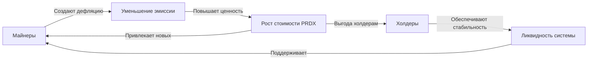

# PARADOX (PRDX) — Пользовательская документация

## 1. Введение

**PARADOX (PRDX)** — это финансовый инструмент на блокчейне TON, созданный как ответ на фундаментальные ограничения существующих денежных систем. Традиционные валюты подвержены инфляции, криптовалюты характеризуются высокой волатильностью, а стейблкоины просто привязывают цифровые активы к существующим фиатным деньгам.

PARADOX предлагает иной подход, реализуя концепцию _идеальных спекулятивных денег_ — системы, где спекулятивный элемент не является хаотичным и непредсказуемым, а строго математически регулируется.

### Ключевые принципы

1. **Математическое ценообразование вместо рыночного**

    - Цена PRDX определяется объективной формулой, связывающей количество токенов с обеспечивающими их резервами
    - Исключает субъективные факторы спроса и предложения

2. **Полное обеспечение резервами**

    - Каждый токен PRDX обеспечен реальными активами (TON)
    - Напоминает золотой стандарт в цифровую эпоху

3. **Контролируемая дефляция через вероятностные механизмы**
    - Использует математически выверенные вероятностные процессы
    - Создает предсказуемое дефляционное давление

### Основные операции

| Операция | Описание                                                                       | Эффект на систему             |
| -------- | ------------------------------------------------------------------------------ | ----------------------------- |
| **Mint** | Создание новых PRDX путем внесения TON в резерв                                | Увеличивает резерв и эмиссию  |
| **Burn** | Обратный обмен PRDX на TON из резерва                                          | Уменьшает резерв и эмиссию    |
| **Mine** | Вероятностный процесс сжигания PRDX с получением случайного количества токенов | Создает дефляционное давление |

### Математическая основа

В основе PARADOX лежит [модель Санкт-Петербургского парадокса](https://ru.wikipedia.org/wiki/Санкт-петербургский_парадокс), описанная математиком Даниилом Бернулли в XVIII веке. Эта модель позволяет создать систему, в которой индивидуальный риск участников (через операцию Mine) трансформируется в коллективную выгоду для всех держателей через постепенное уменьшение общего количества токенов в обращении.

## 2. Математические основы системы

### Базовые переменные

| Переменная    | Описание                              | Значение               |
| ------------- | ------------------------------------- | ---------------------- |
| $R$           | Общий резерв TON в протоколе          | Изменяется динамически |
| $S$           | Общая эмиссия PRDX в обращении        | Изменяется динамически |
| $\phi_{mint}$ | Комиссия для операции Mint            | 0.78%                  |
| $\phi_{burn}$ | Комиссия для операции Burn            | 1.56%                  |
| $EV_{mine}$   | Математическое ожидание операции Mine | -12.5%                 |

### Курсы обмена

**Базовый курс** PRDX к TON определяется соотношением эмиссии к резерву:

$$K_{base} = \frac{S}{R}$$

**Курс для операции Mint:**

$$K_{mint} = \frac{S}{R} \times (1 - \phi_{mint})$$

**Курс для операции Burn:**

$$K_{burn} = \frac{R}{S} \times (1 - \phi_{burn})$$

### Формулы операций

#### Операция Mint

Получение PRDX за TON:

$$PRDX_{received} = TON_{sent} \times K_{mint} = TON_{sent} \times \frac{S}{R} \times (1 - \phi_{mint})$$

#### Операция Burn

Получение TON за PRDX:

$$TON_{received} = PRDX_{sent} \times K_{burn} = PRDX_{sent} \times \frac{R}{S} \times (1 - \phi_{burn})$$

#### Операция Mine

**Минимальная награда:**

$$PRDX_{min} = \frac{2 \times PRDX_{stake} \times (1 - EV_{mine})}{outcomes + 1}$$

где:

-   $PRDX_{stake}$ — количество PRDX, отправленных на майнинг
-   $outcomes$ — количество возможных исходов (от 1 до 32)

**Формула награды для исхода $i$:**

$$PRDX_{reward}(i) = PRDX_{min} \times 2^{i-1}$$

где $i$ — номер исхода (от 1 до $outcomes$)

**Вероятность каждого исхода:**

$$
P(i) = \begin{cases}
\frac{1}{2^i} & \text{для } i = 1, 2, \ldots, outcomes-1 \\
\frac{1}{2^{outcomes-1}} & \text{для } i = outcomes
\end{cases}
$$

**Математическое ожидание:**

$$E[reward] = \sum_{i=1}^{outcomes} PRDX_{reward}(i) \times P(i) = PRDX_{stake} \times (1 - EV_{mine})$$

## 3. Начало работы

### Подключение к системе

1. Запустите приложение [PrdxCoin](https://t.me/PrdxCoinBot) в Telegram
2. Нажмите синюю кнопку **Connect** для подключения кошелька TON
3. Убедитесь, что у вас достаточно TON для операций и комиссий
4. Начинайте с малых сумм для ознакомления с системой

> **Важно:** На текущий момент PARADOX развернут в тестовой сети TON. Доступно подключение тестового кошелька TON.

### Гарантии системы

-   **Полное обеспечение:** Ваши PRDX полностью обеспечены резервами TON
-   **Устойчивость:** Система остается стабильной даже в периоды рыночной турбулентности
-   **Прозрачность:** Все операции математически определены и верифицируемы

## 4. Основные операции

### 4.1 Mint (создание PRDX)

Операция Mint позволяет обменять TON на токены PRDX по математически определенному курсу без влияния спекулятивных факторов.

#### Процедура выполнения

1. На главном экране выберите функцию **"Mint"**
2. Укажите количество TON для конвертации или желаемое количество PRDX
3. Проверьте комиссию (уже включена в расчеты)
4. Подтвердите операцию

#### Пример операции Mint

**Исходное состояние системы:**
| Параметр | Значение |
|----------|----------|
| Резерв ($R$) | 100 TON |
| Эмиссия ($S$) | 100,000 PRDX |
| Курс для Mint ($K_{mint}$) | $\frac{100000}{100} \times (1 - 0.0078) = 992.2$ PRDX/TON |

**Операция:** Отправка 10 TON

**Результат:**
| Параметр | До операции | После операции |
|----------|-------------|----------------|
| Резерв TON | 100 | 110 |
| Эмиссия PRDX | 100,000 | 109,922 |
| Получено PRDX | — | 9,922 |
| Курс (PRDX/TON) | 1,000 | 999.3 |

> **Особенность:** В отличие от рыночных механизмов, операция Mint практически не влияет на курс PRDX/TON, создавая стабильную среду для всех участников.

### 4.2 Burn (обмен PRDX на TON)

Операция Burn обеспечивает полную ликвидность, позволяя обменять PRDX обратно на TON в любой момент времени.

#### Процедура выполнения

1. На главном экране выберите функцию **"Burn"**
2. Укажите количество PRDX для конвертации или желаемое количество TON
3. Проверьте комиссию (уже включена в расчеты)
4. Подтвердите операцию

#### Пример операции Burn

**Исходное состояние системы:**
| Параметр | Значение |
|----------|----------|
| Резерв ($R$) | 100 TON |
| Эмиссия ($S$) | 100,000 PRDX |
| Курс для Burn ($K_{burn}$) | $\frac{100}{100000} \times (1 - 0.0156) = 0.000984$ TON/PRDX |

**Операция:** Отправка 10,000 PRDX

**Результат:**
| Параметр | До операции | После операции |
|----------|-------------|----------------|
| Резерв TON | 100 | 90.16 |
| Эмиссия PRDX | 100,000 | 90,000 |
| Получено TON | — | 9.84 |
| Курс (PRDX/TON) | 1,000 | 998.2 |

> **Гарантия ликвидности:** PRDX обеспечивает возможность обмена на TON по математически определенному курсу в любой момент, фундаментально снижая риск ликвидности.

### 4.3 Mine (майнинг PRDX)

#### Концепция майнинга

Майнинг PRDX — это принципиально новая концепция **контролируемой вероятностной спекуляции**, где:

-   Пользователи сжигают определенное количество PRDX
-   Получают случайное количество новых PRDX на основе строгой вероятностной модели
-   Создается системное дефляционное давление через отрицательное математическое ожидание
-   Индивидуальный риск участников трансформируется в коллективную выгоду

#### Технический процесс

Майнинг реализован как трехэтапная процедура для обеспечения криптографической безопасности:

| Этап | Название         | Описание                                                                          |
| ---- | ---------------- | --------------------------------------------------------------------------------- |
| 1    | **Mine Commit**  | Генерация пользователем случайного числа и отправка его криптографической подписи |
| 2    | **Mine Process** | Запрос смарт-контрактом случайного числа от оракула                               |
| 3    | **Mine Resolve** | Раскрытие пользовательского числа и определение итогового исхода                  |

**Формула определения исхода:**
$$final\_seed = oracle\_seed \oplus user\_seed$$

Где $\oplus$ — операция XOR (исключающее ИЛИ).

Номер исхода определяется как количество последовательных единиц с конца двоичного представления $final\_seed$ плюс один.

#### Ограничения майнинга

Система включает **Mine Limit** для поддержания стабильности:

$$PRDX_{min} \times 2^{outcomes-1} \leq 0.125 \times S$$

Максимально возможный выигрыш не может превышать 12.5% от общей эмиссии PRDX.

#### Примеры майнинга

##### Пример 1: Майнинг с 3 исходами

**Исходные условия:**
| Параметр | Значение |
|----------|----------|
| Резерв ($R$) | 1,000 TON |
| Эмиссия ($S$) | 1,000 PRDX |
| Текущий курс | 1 TON = 1 PRDX |
| Ставка майнинга | 32 PRDX |
| Количество исходов | 3 |

**Расчет минимальной награды:**
$$PRDX_{min} = \frac{2 \times 32 \times (1 - 0.125)}{3 + 1} = \frac{2 \times 32 \times 0.875}{4} = 14 \text{ PRDX}$$

**Таблица возможных исходов:**
| Исход | Награда (PRDX) | Вероятность | Процент |
|-------|----------------|-------------|---------|
| 1 | 14 | 1/2 | 50% |
| 2 | 28 | 1/4 | 25% |
| 3 | 56 | 1/4 | 25% |

**Математическое ожидание:**
$$E[reward] = 14 \times \frac{1}{2} + 28 \times \frac{1}{4} + 56 \times \frac{1}{4} = 28 \text{ PRDX}$$

**Результат при выпадении исхода 3:**
| Параметр | До майнинга | После майнинга |
|----------|-------------|----------------|
| Ваши PRDX | 32 | 56 |
| Резерв TON | 1,000 | 1,000 |
| Общая эмиссия PRDX | 1,000 | 1,024 |
| Курс (PRDX/TON) | 1.000 | 1.024 |

##### Пример 2: Майнинг с 6 исходами

**Исходные условия:**
| Параметр | Значение |
|----------|----------|
| Резерв ($R$) | 1,000 TON |
| Эмиссия ($S$) | 1,000 PRDX |
| Текущий курс | 1 TON = 1 PRDX |
| Ставка майнинга | 16 PRDX |
| Количество исходов | 6 |

**Расчет минимальной награды:**
$$PRDX_{min} = \frac{2 \times 16 \times (1 - 0.125)}{6 + 1} = \frac{2 \times 16 \times 0.875}{7} = 4 \text{ PRDX}$$

**Таблица возможных исходов:**
| Исход | Награда (PRDX) | Вероятность | Процент |
|-------|----------------|-------------|---------|
| 1 | 4 | 1/2 | 50.000% |
| 2 | 8 | 1/4 | 25.000% |
| 3 | 16 | 1/8 | 12.500% |
| 4 | 32 | 1/16 | 6.250% |
| 5 | 64 | 1/32 | 3.125% |
| 6 | 128 | 1/32 | 3.125% |

**Математическое ожидание:**
$$E[reward] = 4 \times \frac{1}{2} + 8 \times \frac{1}{4} + 16 \times \frac{1}{8} + 32 \times \frac{1}{16} + 64 \times \frac{1}{32} + 128 \times \frac{1}{32} = 14 \text{ PRDX}$$

**Результат при выпадении исхода 2:**
| Параметр | До майнинга | После майнинга |
|----------|-------------|----------------|
| Ваши PRDX | 16 | 8 |
| Резерв TON | 1,000 | 1,000 |
| Общая эмиссия PRDX | 1,000 | 992 |
| Курс (PRDX/TON) | 1.000 | 0.992 |

> **Ключевая особенность:** При любом исходе майнинга общая сумма PRDX в системе в среднем уменьшается на 12.5%, создавая дефляционное давление и повышая ценность каждого оставшегося токена.

## 5. Стратегии использования

### 5.1 Стратегия майнера

**Профиль участника:** Активные пользователи, готовые к повышенному риску ради потенциальной высокой прибыли.

#### Характеристики стратегии

| Аспект                 | Описание                                    |
| ---------------------- | ------------------------------------------- |
| **Потенциал прибыли**  | Возможность экспоненциального роста активов |
| **Уровень риска**      | Высокий (возможная потеря части токенов)    |
| **Управление рисками** | Гибкая настройка параметров майнинга        |
| **Роль в системе**     | Поддержка функционирования протокола        |
| **Временной горизонт** | Краткосрочная волатильность                 |

#### Рекомендации для майнеров

-   Начинайте с небольших ставок для изучения механики
-   Варьируйте количество исходов в зависимости от толерантности к риску
-   Рассматривайте майнинг как часть диверсифицированной стратегии

### 5.2 Стратегия холдера

**Профиль участника:** Пассивные инвесторы, ориентированные на долгосрочный рост стоимости активов.

#### Характеристики стратегии

| Аспект                 | Описание                                  |
| ---------------------- | ----------------------------------------- |
| **Источник прибыли**   | Пассивная выгода от дефляционного эффекта |
| **Уровень риска**      | Низкий-средний                            |
| **Временной горизонт** | Долгосрочный (месяцы и годы)              |
| **Участие**            | Минимальное после покупки                 |
| **Роль в портфеле**    | Стабильный диверсифицирующий компонент    |

#### Рекомендации для холдеров

-   Рассматривайте PRDX как долгосрочную инвестицию
-   Используйте стратегию усреднения стоимости при покупке
-   Мониторьте общую активность майнинга в системе

### 5.3 Симбиоз стратегий

Уникальность экосистемы PARADOX заключается в симбиотических отношениях между майнерами и холдерами, создающих позитивный цикл роста системы.

## 6. Часто задаваемые вопросы

### О системе в целом

**В чем отличие PRDX от стейблкоинов?**

| Аспект      | Стейблкоины                        | PRDX                              |
| ----------- | ---------------------------------- | --------------------------------- |
| Цель        | Сохранение фиксированной стоимости | Контролируемый рост стоимости     |
| Механизм    | Привязка к фиатным валютам         | Математическое ценообразование    |
| Характер    | Статичный                          | Дефляционный                      |
| Обеспечение | Фиатные резервы/алгоритмы          | Полное обеспечение криптоактивами |

**Какие риски существуют при использовании PRDX?**

-   **Риск майнинга:** Отрицательное математическое ожидание (-12.5%)
-   **Технологический риск:** Зависимость от блокчейна TON
-   **Ликвидационный риск:** Минимален благодаря механизму Burn
-   **Рыночный риск:** Устранен математическим ценообразованием

### О курсе и волатильности

**Может ли курс PRDX/TON упасть?**

Да, в краткосрочной перспективе курс может колебаться в зависимости от:

-   Активности майнеров
-   Результатов майнинга
-   Соотношения операций Mint/Burn

Однако математическая модель создает долгосрочное дефляционное давление, которое в среднем увеличивает стоимость PRDX.

### О майнинге

**Как операция Mine отличается от обычных спекуляций?**

| Аспект           | Рыночные спекуляции       | Операция Mine                         |
| ---------------- | ------------------------- | ------------------------------------- |
| Предсказуемость  | Низкая                    | Высокая (известные вероятности)       |
| Прозрачность     | Ограниченная              | Полная (открытые алгоритмы)           |
| Справедливость   | Асимметрия информации     | Равные условия для всех               |
| Результат потерь | Прибыль других участников | Распределение между всеми держателями |

**Почему математическое ожидание майнинга отрицательное?**

Отрицательное математическое ожидание (-12.5%) — это не недостаток, а ключевая особенность системы:

1. **Создает дефляционное давление** — из системы изымается больше токенов, чем возвращается
2. **Повышает ценность оставшихся PRDX** для всех участников
3. **Обеспечивает устойчивый рост стоимости** в долгосрочной перспективе
4. **Трансформирует индивидуальный риск** в коллективную выгоду

## 7. Глоссарий

| Термин                           | Определение                                                                      |
| -------------------------------- | -------------------------------------------------------------------------------- |
| **PARADOX**                      | Название проекта; система финансовых инструментов на блокчейне TON               |
| **PRDX**                         | Токен системы PARADOX с дефляционными характеристиками                           |
| **MINT**                         | Создание PRDX в обмен на TON с зачислением TON в резерв протокола                |
| **BURN**                         | Сжигание PRDX в обмен на TON с возвратом TON из резерва протокола                |
| **MINE**                         | Сжигание PRDX с получением стохастического исхода на основе вероятностной модели |
| **MINE LIMIT**                   | Ограничение максимально возможного выигрыша при майнинге (12.5% от эмиссии)      |
| **ORACLE**                       | Система генерации криптостойких случайных чисел для майнинга                     |
| **SEED**                         | Случайное число, используемое при генерации исходов майнинга                     |
| **Final_seed**                   | Результат операции XOR между числами пользователя и оракула                      |
| **Outcomes**                     | Количество возможных исходов при майнинге (от 1 до 32)                           |
| **Математическое ожидание (EV)** | Средний результат операции при большом количестве повторений                     |
| **Дефляционное давление**        | Эффект уменьшения количества токенов, приводящий к росту их ценности             |
| **Санкт-Петербургский парадокс** | Классическая вероятностная модель, лежащая в основе системы майнинга             |

## 8. Заключение

**PARADOX (PRDX)** представляет собой эволюционный шаг в развитии цифровых финансовых инструментов. Система демонстрирует, как современные технологии блокчейна могут решить фундаментальные проблемы традиционных денежных систем:

### Ключевые достижения

-   **Математическая детерминированность** вместо рыночного хаоса
-   **Контролируемая дефляция** вместо инфляционного обесценивания
-   **Прозрачные алгоритмы** вместо непредсказуемых спекуляций
-   **Справедливое распределение рисков** между всеми участниками

### Инновационность решения

PARADOX доказывает возможность создания финансовых инструментов, которые:

1. **Сочетают стабильность и рост** — обеспечивая предсказуемость без стагнации
2. **Трансформируют спекуляции** — превращая хаотичный процесс в математически выверенный механизм
3. **Создают справедливую среду** — где все участники имеют равный доступ к информации и возможностям
4. **Обеспечивают устойчивость** — через полное резервное обеспечение и математические гарантии

Математические формулы, лежащие в основе всех операций, гарантируют прозрачность и предсказуемость системы, позволяя каждому участнику принимать обоснованные решения на основе объективных данных.

PARADOX открывает новую эру **математических денег** — где технология служит созданию более справедливых, прозрачных и эффективных финансовых отношений.
