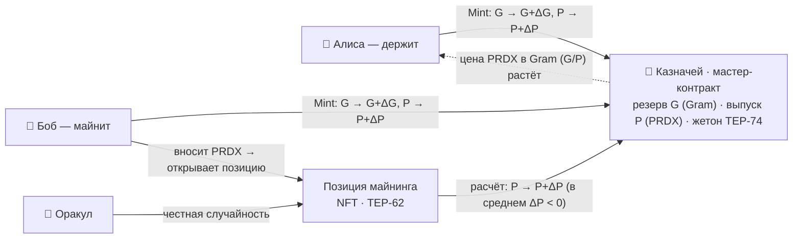
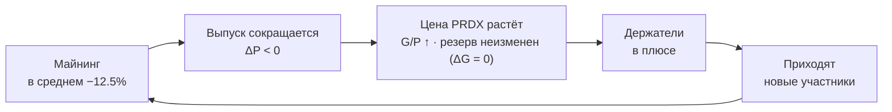
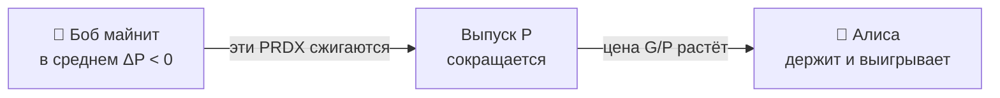
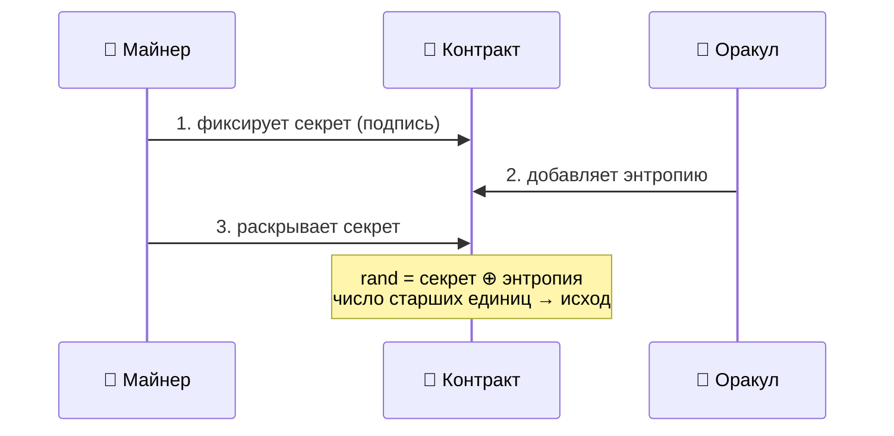
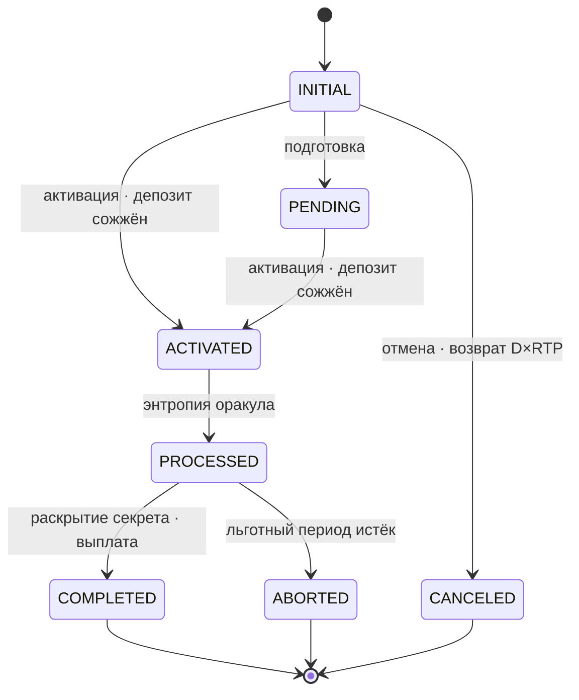

# PARADOX (PRDX)

> 🌐 **[English version](../en/docs.md)**

**PRDX — первый в мире математический токен: его цена задаётся формулой, а не рынком.**

Если совсем коротко: PRDX — это **цифровой токен** (жетон) сети TON, которым **не торгуют на бирже** — нет ни спекуляции, ни рыночных колебаний. Каждый токен **на 100% обеспечен Gram**, как золотой стандарт 🥇. А **майнинг** — сердце протокола: встроенный механизм с открытыми, заранее известными правилами, который растит цену для держателей и даёт шанс приумножить токены.

    

| Контракт | Адрес |
|----------|-------|
| [Paradox Master](https://testnet.tonviewer.com/kQAi9ONGfiP28aeqJW6hAWh54r9LLvFUYbr9ViYfAuaLi2UO) [TESTNET] | EQAi9ONGfiP28aeqJW6hAWh54r9LLvFUYbr9ViYfAuaLi96E |

> ⚠️ **Стадия testnet.** PARADOX развёрнут в тестовой сети TON. Все операции используют тестовые Gram, у которых **нет реальной ценности**. Не отправляйте в протокол Gram из основной сети или реальные средства.

---

## Содержание

**Понять за минуту**

- [1. Большая картина](#1-большая-картина)
- [2. Фундамент: Санкт-Петербургский парадокс](#2-фундамент-санкт-петербургский-парадокс)
- [3. Две стратегии: Алиса и Боб](#3-две-стратегии-алиса-и-боб)

**Как это работает**

- [4. Казначей и курс](#4-казначей-и-курс)
- [5. Mint и Burn](#5-mint-и-burn-обмен-gram-и-prdx)
- [6. Mine](#6-mine-игра-создающая-ценность)
- [7. Оракул и честная случайность](#7-оракул-и-честная-случайность)
- [8. Жизненный цикл позиции (NFT)](#8-жизненный-цикл-позиции-nft)

**Справочник**

- [9. Параметры и обозначения](#9-параметры-и-обозначения)
- [10. Техническая спецификация](#10-техническая-спецификация)

**Практика**

- [11. Начало работы](#11-начало-работы)
- [12. Риски](#12-риски)
- [13. FAQ и глоссарий](#13-faq-и-глоссарий)

---

## 1. Большая картина

**TL;DR** — *Алиса и Боб вносят в протокол Gram (**ΔG**) и получают PRDX. Боб участвует в майнинге: вносит часть своих PRDX, и протокол по открытым правилам и честной случайности превращает их в новое количество — иногда больше, иногда меньше. В среднем участник майнинга оказывается в небольшом минусе, поэтому выпуск PRDX (**P**) сокращается, а при неизменном резерве Gram (**G**) цена PRDX растёт.*

Весь протокол описывается через четырёх действующих лиц:

- 👩 **Алиса** — осторожный держатель: покупает PRDX и держит.
- 👨 **Боб** — активный участник: через майнинг пытается увеличить свои PRDX.
- 🏦 **Казначей** — смарт-контракт протокола. Хранит резерв Gram, выпускает и сжигает PRDX и ведёт всего две величины: **G** — сколько Gram в резерве, и **P** — сколько PRDX выпущено.
- 🎲 **Оракул** — источник честной случайности, на которой строится майнинг.

```mermaid
flowchart LR
    A["👩 Алиса — держит"]
    B["👨 Боб — майнит"]
    T["🏦 Казначей · мастер-контракт<br/>резерв G (Gram) · выпуск P (PRDX) · жетон TEP-74"]
    N["Позиция майнинга<br/>NFT · TEP-62"]
    O["🎲 Оракул"]

    A -->|"Mint: G → G+ΔG, P → P+ΔP"| T
    B -->|"Mint: G → G+ΔG, P → P+ΔP"| T
    B -->|"вносит PRDX → открывает позицию"| N
    O -->|"честная случайность"| N
    N -->|"расчёт: P → P+ΔP (в среднем ΔP &lt; 0)"| T
    T -.->|"цена PRDX в Gram (G/P) растёт"| A
```

### Как это работает

**Выпуск.** Чтобы получить PRDX, Алиса и Боб вносят в контракт некоторое количество Gram — обозначим его **ΔG**; в ответ Казначей выпускает им новые PRDX по текущему курсу, и увеличиваются *обе* записи: резерв **G → G + ΔG** и выпуск **P → P + ΔP**. Доступна и обратная операция: вернув PRDX, можно забрать свою долю Gram — тогда возвращённые PRDX **сжигаются** 🔥, и обе записи уменьшаются на свои Δ: **P → P − ΔP**, **G → G − ΔG**.

**Майнинг.** Майнинг — это игра с полностью открытыми правилами. Боб вносит часть своих PRDX, и протокол превращает их в новое количество; исход определяется честной случайностью (подробнее в §7) и заранее известными вероятностями. Профиль риска Боб выбирает сам — от осторожного, где исходы держатся близко к внесённому, до агрессивного, где редкий исход может оказаться в разы крупнее. Каждая такая операция оформляется отдельной **NFT-позицией**.

**Влияние на курс.** Результат майнинга меняет только выпуск: новый выпуск равен **P + ΔP**, где ΔP положительна при удачном исходе и отрицательна при неудачном. Резерв **не трогается (ΔG = 0)**. А поскольку цена PRDX — это соотношение резерва и выпуска (**G/P**), любое **ΔP** сразу сдвигает курс для всех держателей.

**Зеркальные роли.** В этом и связь Алисы и Боба: то, что участник майнинга в среднем теряет, оборачивается выгодой для всех, кто держит PRDX, — в том числе для самой Алисы.

**Почему система устойчива.** Правила майнинга подобраны так, что в среднем участник возвращает меньше, чем вносит: сейчас средняя отдача — 87.5%, то есть −12.5%. Этот заложенный перевес не достаётся никакому посреднику — соответствующие PRDX просто сжигаются. В среднем **ΔP < 0**, поэтому выпуск со временем сокращается, а при неизменном резерве (**ΔG = 0**) цена PRDX в Gram (**G/P**) неуклонно растёт.

- Для Алисы это спокойный рост: её PRDX дорожают, пока она просто держит. 📈
- Для Боба это возможность по открытым правилам заметно увеличить свои PRDX, приняв просчитанный риск.

```mermaid
flowchart LR
    M["Майнинг<br/>в среднем −12.5%"] --> SUP["Выпуск сокращается<br/>ΔP &lt; 0"]
    SUP --> PR["Цена PRDX растёт<br/>G/P ↑ · резерв неизменен (ΔG = 0)"]
    PR --> H["Держатели<br/>в плюсе"]
    H --> NEW["Приходят<br/>новые участники"]
    NEW --> M
```

**Сетевой эффект.** Чем больше в системе таких участников, как Алиса и Боб, тем точнее работает протокол: ценность PRDX всё ближе держится математического идеала. Каждый новый участник усиливает надёжность и эффективность системы для всех.

---

## 2. Фундамент: Санкт-Петербургский парадокс

**TL;DR** — *В основе PARADOX лежит парадокс XVIII века о том, как человек оценивает риск. Классическая игра обещает бесконечный выигрыш, но никто не платит за неё много. PARADOX впервые делает эту идею работающей on-chain: добавляет перевес в пользу держателей (он сжигается) и лимит — и превращает мысленный эксперимент в устойчивую экономику.*

PARADOX — не просто токен с дефляцией. Это **переосмысление двухсотлетнего парадокса теории вероятностей** через призму блокчейна.

### 2.1. Откуда идея

В 1738 году швейцарский математик **Даниил Бернулли**, работавший в Петербургской академии наук, опубликовал трактат *«Изложение новой теории об измерении риска»* (*Specimen theoriae novae de mensura sortis*). В нём он разбирал задачу, которая вошла в историю как **Санкт-Петербургский парадокс** — и стала отправной точкой этого проекта.

### 2.2. Сам парадокс

Представьте игру. Монету подбрасывают, пока не выпадет решка. Выплата удваивается с каждым броском: решка на первом броске даёт 2 монеты, на втором — 4, на третьем — 8, и так далее — $2^n$ монет на $n$-м броске.

Сколько справедливо заплатить за вход? Посчитаем математическое ожидание выигрыша:

$$
\mathbb{E} = \tfrac{1}{2}\cdot 2 + \tfrac{1}{4}\cdot 4 + \tfrac{1}{8}\cdot 8 + \ldots = 1 + 1 + 1 + \ldots = \infty
$$

Оно **бесконечно**. Формально — за вход стоит отдать любую сумму. Но на практике никто не заплатит больше горстки монет (обычно 20–30). Вот и парадокс: **бесконечная «справедливая» цена против скромной готовности платить**.

### 2.3. Главное — не среднее, а разброс

Почему ожидание получилось бесконечным? Из-за устройства выплат: они растут экспоненциально (2, 4, 8, …, $2^n$), а вероятности так же экспоненциально падают ($\tfrac12, \tfrac14, \tfrac18, \ldots$). Почти всегда игра заканчивается быстро и платит мало; но изредка выпадает длинная серия — и выплата становится колоссальной. Среднее «раздувается» именно за счёт этих редчайших джекпотов.

Это и есть ключевая черта игры — **огромный разброс** исходов (по-научному — дисперсия). Математическое ожидание говорит, сколько вы получите *в среднем*; разброс — насколько далеко отдельный исход может **отклониться** от среднего. Обычно исходы держатся близко к среднему. Здесь разброс экспоненциально велик: подавляющее большинство попыток — небольшой проигрыш, редкие — выигрыш в разы.

Именно разброс делает игру интересной. В неё играют не ради среднего (оно даже отрицательное), а ради **асимметрии**: небольшая известная цена за шанс на крупный, многократный выигрыш — по заранее открытым и честным правилам. Эту асимметрию и «покупает» Боб.

### 2.4. Как его разрешил Бернулли

Бернулли заметил: люди ценят не сами деньги, а их **полезность**, и эта полезность **убывает** — лишняя монета для бедного значит больше, чем для богатого. Поэтому разумный человек смотрит не на ожидаемый *выигрыш*, а на ожидаемую *полезность*, а она уже конечна.

Идея оказалась фундаментальной: из неё выросли теория полезности, теория принятия решений и вся современная экономика риска. Бернулли впервые показал, что **риск можно измерять**.

### 2.5. Переосмысление через блокчейн

Классический парадокс невозможно сыграть по-настоящему: выплата неограниченна, её нечем обеспечить, а правила живут только на бумаге. PARADOX берёт ту же конструкцию и впервые делает её **реальной, конечной и устойчивой** — двумя точными изменениями:

| | Классический парадокс | PARADOX |
|---|---|---|
| **Выплата** | неограниченная ($2^n$) | ограничена лимитом |
| **Матожидание** | бесконечное | RTP < 100% — отрицательное для участника |
| **Встроенная маржа** | нет | есть, но **сжигается** в пользу держателей |
| **Правила** | мысленный эксперимент | смарт-контракт, неизменные |
| **Честность** | на доверии | provably-fair, проверяемая |
| **Итог** | неиграбелен | устойчивая экономика |

При этом PARADOX сохраняет саму суть игры — **высокий разброс и асимметрию** (§2.3), — обрезая лимитом лишь бесконечный «хвост». Более того, уровень разброса участник выбирает сам: от осторожного до агрессивного (параметр $n$, см. §6) — при неизменной средней отдаче.

Главное здесь — **инверсия смысла**. У Бернулли систематический проигрыш участника относительно бесконечного ожидания — это загадка. В PARADOX тот же систематический проигрыш (−12.5%) — **двигатель**: он сжигает токены и поднимает курс для всех держателей. Риск перестаёт быть тем, что минимизируют, и становится **конструктивной силой**. Отсюда и название.

А разделение людей по отношению к риску, которое описал Бернулли, оживает в двух стратегиях: осторожная **Алиса** и рисковый **Боб**. И то, чего не было у мысленного эксперимента, появляется здесь: **прозрачные неизменные правила в смарт-контракте и проверяемая честность** (provably-fair) — такой игре можно доверять без оператора-посредника.

Бернулли *описал*, как человек оценивает риск. PARADOX превращает это описание в **механизм, который задаёт цену токена**.

---

## 3. Две стратегии: Алиса и Боб

**TL;DR** — *Алиса и Боб — это две чистые стратегии. Алиса покупает PRDX и держит, выигрывая от дефляции без риска. Боб майнит, принимая просчитанный риск ради шанса быстро приумножить. Они зеркальны: средний проигрыш Боба превращается в выигрыш Алисы.*

Алиса и Боб — не два разных человека, а **две чистые стратегии участия**. Реальный участник может их сочетать, но именно эти два полюса объясняют всю систему.

| | 👩 **Алиса** | 👨 **Боб** |
|---|---|---|
| Стратегия | консервативная | активная |
| Что делает | покупает PRDX и держит | майнит частью своих PRDX |
| Риск | минимальный | просчитанный (отдача < 100%) |
| Источник выгоды | дефляция — рост цены **G/P** | редкие крупные исходы (высокий разброс) |
| Участие | пассивное | активное |
| Итог | спокойный рост | шанс быстро приумножить |

**Зеркальность.** Майнинг Боба в среднем убыточен (−12.5%), и эта «потеря» не исчезает и не достаётся посреднику — она сжигается, сокращая выпуск **P**. А меньший выпуск при том же резерве означает рост цены **G/P** для всех держателей — в том числе для Алисы, которая просто держит.

```mermaid
flowchart LR
    B["👨 Боб майнит<br/>в среднем ΔP &lt; 0"] -->|"эти PRDX сжигаются"| POOL["Выпуск P<br/>сокращается"]
    POOL -->|"цена G/P растёт"| A["👩 Алиса<br/>держит и выигрывает"]
```

Получается честная сделка двух ролей: Боб **покупает** разброс — шанс на крупный, многократный выигрыш (§2.3), оплачивая его небольшим средним убытком; Алиса этот убыток **получает** в виде роста цены. При этом Боб сам настраивает уровень разброса — от осторожного до агрессивного — не меняя среднюю отдачу. Чем больше Бобов и Алис, тем точнее и устойчивее работает протокол.

---

## 4. Казначей и курс

**TL;DR** — *Казначей хранит две величины: резерв **G** (Gram) и выпуск **P** (PRDX). Цена одного PRDX — это **G/P**. Mint и Burn меняют G и P пропорционально, поэтому цену не двигают. Только майнинг меняет P при неизменном G — и за счёт этого цена растёт.*

Весь «банк» протокола — это две цифры в смарт-контракте: сколько Gram лежит в резерве и сколько PRDX выпущено. Из них выводится всё остальное.

### 4.1. Две величины и курс

- **G** — Gram в резерве;
- **P** — выпущенные PRDX в обращении.

Базовый курс — это сколько PRDX выдаётся за 1 Gram:

$$
\text{курс} = \frac{P}{G}
$$

Обратная величина — **цена одного PRDX в Gram**. Именно её рост означает, что PRDX дорожает:

$$
\text{цена PRDX} = \frac{G}{P}
$$

> *Пример.* Если в резерве **G = 100** Gram и выпущено **P = 100 000** PRDX, то курс — 1000 PRDX за Gram, а цена одного PRDX — 0.001 Gram.

### 4.2. Почему Mint и Burn не двигают цену

При выпуске Алиса вносит **ΔG** Gram — и Казначей увеличивает **обе** величины пропорционально: резерв на внесённые Gram, выпуск на соответствующие PRDX. Их соотношение **G/P не меняется**. При сжигании всё наоборот: обе величины уменьшаются пропорционально, и цена снова на месте.

Поэтому Mint и Burn — это **честный обмен по текущей цене**: они не размывают и не обогащают держателей. (Комиссия протокола при этом удерживается отдельно и в резерв не попадает — подробный разбор с числами в §5.)

**Здесь нет рынка.** Мы привыкли, что токен торгуется на бирже: цена скачет от спроса и предложения, и на этих колебаниях спекулируют. В PARADOX такого нет. Gram и PRDX вы всегда обмениваете напрямую с протоколом по одной и той же формульной цене **G/P** — не с другими участниками и не по «рыночному курсу». Купить дешевле у одного и перепродать дороже другому бессмысленно: единственная цена — это **G/P**, и сдвигает её только майнинг, а не настроения толпы. PRDX остаётся стандартным жетоном — его видят кошельки и эксплореры, — но его ценность держится на резерве и формуле, а не на торговле.

### 4.3. Почему цена растёт

Майнинг — **единственная** операция, которая меняет выпуск **P**, не трогая резерв **G**. В среднем **ΔP < 0**, поэтому выпуск сокращается, а цена **G/P** растёт.

Важно: рост **не автоматический**. Его темп пропорционален тому, сколько фактически майнят. Модель гарантирует *направление* (каждая операция в среднем сокращает выпуск), а *темп* задаёт активность — без майнинга цена стоит на месте.

Допустим, в каждом раунде участники суммарно сжигают ≈ 1000 PRDX, а резерв не трогается:

| Раунд | ΔP (сожжено) | Выпуск P | Резерв G | Цена 1000 PRDX |
|-------|--------------|----------|----------|----------------|
| 0 (старт) | — | 100 000 | 100 | 1.0000 Gram |
| 1 | −1 000 | 99 000 | 100 | 1.0101 Gram |
| 2 | −1 000 | 98 000 | 100 | 1.0204 Gram |
| 3 | −1 000 | 97 000 | 100 | 1.0309 Gram |

Алиса держала 1000 PRDX все три раунда и ничего не делала — но их цена выросла с 1.000 до 1.031 Gram (**+3.1%**), целиком за счёт чужого майнинга. Уменьшите объём раунда вдвое — цена будет расти вдвое медленнее; без майнинга не вырастет вовсе.

---

## 5. Mint и Burn: обмен Gram и PRDX

**TL;DR** — *Mint выпускает PRDX за внесённые Gram, Burn делает обратное и сжигает PRDX. Обе операции берут небольшую комиссию, которая удерживается отдельно и не попадает в резерв, — поэтому курс остаётся на месте (§4.2). Это просто честный обмен по текущей цене.*

Это две зеркальные операции обмена. Они доступны любому держателю и, в отличие от майнинга, ничего не оставляют на волю случая.

### 5.1. Mint — выпуск PRDX

Алиса вносит Gram и получает свежевыпущенные PRDX по текущему курсу:

1. Алиса отправляет Gram со своего кошелька.
2. Удерживается комиссия протокола $\phi_{\text{mint}}$.
3. Оставшиеся Gram поступают в резерв (**G ↑**).
4. На эту сумму по курсу выпускаются новые PRDX (**P ↑**).
5. Новые PRDX отправляются Алисе.

Курс выпуска (PRDX за 1 Gram) — это базовый курс за вычетом комиссии:

$$
\text{курс Mint} = \frac{P}{G}\,(1 - \phi_{\text{mint}})
$$

**Пример.** Старт: выпуск $P = 100\,000$ PRDX, резерв $G = 100$ Gram, курс $P/G = 1000$ PRDX/Gram. У Алисы 50 Gram. Она вносит $\Delta G = 10$ Gram.

- Комиссия: $10 \times 1.5625\% = 0.15625$ Gram
- В резерв: $10 - 0.15625 = 9.84375$ Gram
- Выпущено: $9.84375 \times 1000 = 9843.75$ PRDX

| | Было | Стало | Δ |
|---|---|---|---|
| Выпуск **P** | 100 000 PRDX | 109 843.75 PRDX | +9 843.75 |
| Резерв **G** | 100 Gram | 109.84375 Gram | +9.84375 |
| Алиса · Gram | 50 | 40 | −10 |
| Алиса · PRDX | 0 | 9 843.75 | +9 843.75 |
| Курс **P/G** | 1000 | 1000 | без изменений |

Комиссия (0.15625 Gram) удержана отдельно и в резерв не попала — поэтому **G** и **P** выросли пропорционально, а курс не сдвинулся.

### 5.2. Burn — погашение PRDX

Обратная операция: держатель возвращает PRDX и получает свою долю Gram, а возвращённые PRDX сжигаются.

1. Держатель отправляет PRDX.
2. Удерживается комиссия $\phi_{\text{burn}}$ (в PRDX).
3. Остальные PRDX сжигаются (**P ↓**).
4. По курсу из резерва высвобождаются Gram (**G ↓**) и уходят держателю.

Курс погашения (Gram за 1 PRDX) — это цена PRDX за вычетом комиссии:

$$
\text{курс Burn} = \frac{G}{P}\,(1 - \phi_{\text{burn}})
$$

**Пример.** Тот же старт ($P = 100\,000$, $G = 100$). Держатель гасит 10 000 PRDX.

- Комиссия: $10\,000 \times 1.5625\% = 156.25$ PRDX
- Сожжено: $10\,000 - 156.25 = 9843.75$ PRDX
- Получено: $9843.75 \times 0.001 = 9.84375$ Gram

| | Было | Стало | Δ |
|---|---|---|---|
| Выпуск **P** | 100 000 PRDX | 90 156.25 PRDX | −9 843.75 |
| Резерв **G** | 100 Gram | 90.15625 Gram | −9.84375 |
| Курс **P/G** | 1000 | 1000 | без изменений |

> Между транзакциями курс **всё же** движется — так работает дефляционный механизм из §4.3: майнинг постоянно меняет выпуск, и цена сдвигается. Поэтому Mint и Burn принимают необязательный параметр допустимого отклонения курса (slippage): если к моменту исполнения цена ушла за заданную границу, операция отменяется. Подробнее в §10.

---

## 6. Mine: игра, создающая ценность

**TL;DR** — *Майнинг превращает внесённые PRDX в один из исходов по открытым вероятностям. В среднем возвращается 87.5% (то есть −12.5%), и этот перевес сжигается — он и есть источник дефляции. Параметр $n$ задаёт разброс: от осторожной игры до редких крупных выигрышей, при той же средней отдаче. Выигрыш ограничен сверху лимитом.*

Майнинг — это игра с полностью открытыми правилами: все исходы и их вероятности известны заранее, а случайность честная и проверяемая (§7). Боб вносит депозит **D** в PRDX и получает один из исходов.

### 6.1. Одна попытка: исходы и вероятности

В одной попытке ровно **n** возможных исходов (от 2 до 32). Исход $i$ выплачивает $E \cdot 2^{\,i-1}$ — каждый следующий вдвое крупнее, — с вероятностью:

$$
p_i = \begin{cases}
\dfrac{1}{2^{\,i}} & i = 1, 2, \ldots, n-1 \\[6pt]
\dfrac{1}{2^{\,n-1}} & i = n
\end{cases}
$$

Здесь **E** (Entry) — базовая единица награды, наименьший возможный исход. Первые $n-1$ исходов следуют простому правилу монетки: вероятность каждого следующего вдвое меньше (½, ¼, ⅛, …). Последний, $n$-й, исход забирает всю оставшуюся вероятность — поэтому редкие крупные выплаты возможны, но маловероятны.

### 6.2. Депозит и средняя отдача

Депозит **D** рассчитывается так, чтобы средняя отдача всей игры была ровно **RTP** (сейчас 87.5%):

$$
D = \frac{a \cdot E \cdot (n + 1)}{2\,\text{RTP}}
\qquad\Longleftrightarrow\qquad
E = \frac{2\,D\,\text{RTP}}{a\,(n + 1)}
$$

(параметр $a$ — число попыток, о нём в §6.4). Отсюда ожидаемая выплата:

$$
\mathbb{E}[\text{выплата}] = a \cdot \frac{E\,(n+1)}{2} = D \cdot \text{RTP}
$$

То есть в среднем игра возвращает 87.5% депозита — чистые **−12.5%**, независимо от $n$ и $a$. Эти 12.5% не достаются никому: соответствующие PRDX сжигаются, и именно они питают дефляцию.

### 6.3. Как $n$ управляет разбросом

Главная гибкость майнинга: **$n$ меняет разброс, не трогая среднюю отдачу** (§2.3). При маленьком $n$ исходы держатся близко к депозиту; при большом — появляются редкие, но в разы более крупные выплаты, а обычные исходы становятся чуть мельче. Сравним два профиля (оба — одна попытка, $a = 1$):

*Осторожный — депозит 32 PRDX, $n = 3$* (тогда $E = 14$):

| Исход $i$ | Выплата | Вероятность $p_i$ | Итог |
|---|---|---|---|
| 1 | 14 | 50% | −18 |
| 2 | 28 | 25% | −4 |
| 3 | 56 | 25% | +24 |

*Агрессивный — депозит 16 PRDX, $n = 6$* (тогда $E = 4$):

| Исход $i$ | Выплата | Вероятность $p_i$ | Итог |
|---|---|---|---|
| 1 | 4 | 50% | −12 |
| 2 | 8 | 25% | −8 |
| 3 | 16 | 12.5% | 0 |
| 4 | 32 | 6.25% | +16 |
| 5 | 64 | 3.125% | +48 |
| 6 | 128 | 3.125% | +112 |

У обоих профилей одна и та же отдача 87.5% — но второй даёт куда более широкий разброс: редкий исход приносит +112 при депозите 16. Это и есть выбор Боба между осторожной и агрессивной игрой.

### 6.4. Несколько попыток

Можно сделать не одну попытку, а сразу **a** — тогда выплата равна сумме $a$ независимых попыток. Средняя отдача остаётся 87.5% при любом $a$, меняется лишь форма распределения. Наименьший возможный итог — когда каждая попытка даёт минимум:

$$
\text{минимум} = E \cdot a
$$

### 6.5. Лимит выплаты и эффект для системы

Итоговая выплата ограничена сверху долей от текущего выпуска:

$$
\text{выплата} = \min\big(\text{итог},\; L \cdot P\big)
$$

Даже при самой удачной серии одна операция не может выпустить больше $L = 12.5\%$ от текущего выпуска $P$; всё сверх лимита просто не выпускается. Так система защищена от единичного сверхкрупного выигрыша.

**Эффект для системы.** Старт: $P = 100\,000$, $G = 100$, у Боба 1000 PRDX. Боб майнит с депозитом 32, $n = 3$, $a = 1$. Пусть выпал исход 2 (выплата 28):

| | Было | Стало | Δ |
|---|---|---|---|
| Выпуск **P** | 100 000 | 99 996 | −4 |
| Резерв **G** | 100 | 100 | 0 |
| Боб · PRDX | 1000 | 996 | −4 |

Боб внёс 32, получил 28 — на 4 PRDX меньше. Эти 4 PRDX сожжены: выпуск **P** упал, резерв **G** цел, значит цена **G/P** выросла для **всех** держателей — в том числе для Алисы. Повторяясь у множества участников, такие сжигания и складываются в дефляцию из §4.3.

---

## 7. Оракул и честная случайность

**TL;DR** — *Исход майнинга не может подкрутить ни майнер, ни оракул. Результат — это XOR двух независимых частей: секрета майнера и энтропии оракула. Секрет фиксируется до того, как добавлена энтропия, — поэтому заранее предсказать или подменить исход в одиночку невозможно.*

Для любой игры на случайности главный вопрос: **кто контролирует результат?** В PARADOX — никто в одиночку. Случайное число, выбирающее исход, складывается из двух независимых частей:

$$
\text{rand} = \text{секрет майнера} \oplus \text{энтропия оракула}
$$

(здесь $\oplus$ — это XOR, побитовое «исключающее или».)

Порядок шагов (схема **commit-reveal** — «зафиксируй и раскрой»):

1. **Майнер фиксирует.** При подготовке операции он заранее закрепляет свой секрет — отправляет его подпись. После этого изменить секрет уже нельзя.
2. **Оракул добавляет энтропию.** Независимо и не зная секрета, оракул поставляет свою случайную часть.
3. **Майнер раскрывает.** Он открывает секрет (контракт сверяет его с ранее отправленной подписью). Результат — секрет XOR энтропия; число старших единичных битов в нём и выбирает исход.

```mermaid
sequenceDiagram
    participant U as 👤 Майнер
    participant C as 🏦 Контракт
    participant O as 🎲 Оракул
    U->>C: 1. фиксирует секрет (подпись)
    O->>C: 2. добавляет энтропию
    U->>C: 3. раскрывает секрет
    Note over C: rand = секрет ⊕ энтропия<br/>число старших единиц → исход
```

Поскольку секрет зафиксирован **до** энтропии, а энтропия от секрета не зависит, **ни одна сторона не может предсказать или подкрутить исход в одиночку.** Правила записаны в смарт-контракте, а вероятности известны заранее — это и значит **provably-fair** (доказуемо честно).

---

## 8. Жизненный цикл позиции (NFT)

**TL;DR** — *Каждый майнинг — это отдельная NFT-позиция, проходящая через состояния. Главная гарантия: средства не могут «зависнуть» — у каждого состояния есть путь выхода.*

Каждая операция майнинга оформляется отдельной **NFT-позицией** (TEP-62) со своей машиной состояний:

```mermaid
stateDiagram-v2
    [*] --> INITIAL
    INITIAL --> PENDING: подготовка
    INITIAL --> ACTIVATED: активация · депозит сожжён
    INITIAL --> CANCELED: отмена · возврат D×RTP
    PENDING --> ACTIVATED: активация · депозит сожжён
    ACTIVATED --> PROCESSED: энтропия оракула
    PROCESSED --> COMPLETED: раскрытие секрета · выплата
    PROCESSED --> ABORTED: льготный период истёк
    COMPLETED --> [*]
    ABORTED --> [*]
    CANCELED --> [*]
```

Жизненный цикл построен вокруг одной гарантии: **средства не теряются**. Из каждого состояния есть выход:

- **Отмена (до активации).** Майнер может выйти заранее: возвращается **D × RTP**, а сжигается только маржа **(1 − RTP)**. Случайность ещё не разыграна, поэтому преимущества это не даёт.
- **Активация.** Депозит **D** сжигается из выпуска — позиция вступает в игру.
- **Раскрытие в льготный период → Complete.** Как только оракул доставил энтропию, открывается **льготный период** (сейчас 7 дней). Владелец раскрывает секрет и получает выплату **min(итог, L · P)**.
- **Abort (льготный период пропущен).** Если владелец не раскрыл секрет вовремя, позицию можно закрыть по минимуму **E · a** — как если бы каждая попытка дала наименьший исход. Позиция в любом случае закрывается, тянуть нет смысла.
- **Надёжность доставки.** Если выплату невозможно доставить, PRDX откладываются для ручного возврата и не теряются.

Короче говоря, единственное, что система вообще удерживает от майнинга, — это математическая маржа, питающая дефляцию; всё прочее либо возвращается майнеру, либо сжигается на благо всех держателей.

---

## 9. Параметры и обозначения

**TL;DR** — *единый справочник: текущие значения параметров и все обозначения, встречающиеся в документации.*

### 9.1. Параметры

| Параметр | Значение | Смысл |
|---|---|---|
| $\phi_{\text{mint}}$ | 0.015625 | комиссия Mint (1.5625%) |
| $\phi_{\text{burn}}$ | 0.015625 | комиссия Burn (1.5625%) |
| $\text{RTP}$ | 0.875 | средняя отдача майнинга (87.5%); средний результат = RTP − 1 = −12.5% |
| $L$ | 0.125 | лимит выплаты майнинга (12.5% от выпуска $P$) |

> Это **текущие** значения. Они настраиваются управлением протокола (§10.4) и могут меняться по мере развития.

### 9.2. Обозначения

| Символ | Значение |
|---|---|
| $G$ | резерв в Gram |
| $P$ | выпуск PRDX в обращении |
| $\Delta G,\ \Delta P$ | изменение резерва / выпуска (со знаком) |
| $P/G$ | базовый курс — PRDX за 1 Gram |
| $G/P$ | цена одного PRDX в Gram (растёт со временем) |
| $\phi_{\text{mint}},\ \phi_{\text{burn}}$ | комиссии Mint и Burn |
| $\text{RTP}$ | средняя отдача майнинга (0.875) |
| $L$ | лимит выплаты, доля от $P$ |
| $D$ | депозит в майнинг (PRDX) |
| $n$ | число исходов в одной попытке (2–32) |
| $a$ | число попыток в операции |
| $E$ | Entry — базовая единица награды попытки |
| $p_i$ | вероятность исхода $i$ |
| $\mathbb{E}[\,\cdot\,]$ | математическое ожидание |

---

## 10. Техническая спецификация

**TL;DR** — *построено на стандартах TON (TEP-74, TEP-89, TEP-62): PRDX работает «из коробки» со стандартными кошельками и эксплорерами. Один master-контракт + кошелёк на держателя + NFT на каждую операцию. Экономические параметры настраиваются управлением.*

### 10.1. Соответствие стандартам

| Стандарт | Область |
|---|---|
| **TEP-74** | Jetton (взаимозаменяемый токен) — сам PRDX и кошельки держателей |
| **TEP-89** | обнаружение адреса jetton-кошелька |
| **TEP-62** | NFT — каждая позиция майнинга это NFT-item коллекции протокола |

### 10.2. Архитектура контрактов

- **Единый master-контракт (singleton).** Объединяет минтер jetton, автоматический пул ценообразования, NFT-коллекцию и администрирование. Резерв $G$ и выпуск $P$ хранятся на нём и читаются on-chain в любой момент.
- **Отдельный кошелёк у каждого держателя** — свой jetton-кошелёк PRDX.
- **Отдельный майнер на каждую операцию** — отдельный NFT-item со своей машиной состояний (§8).
- **Библиотечный код.** Логика кошелька и майнера публикуется один раз как on-chain библиотеки; отдельные контракты хранят только ссылку-хеш — это минимизирует их размер.

### 10.3. Ценообразование и slippage

Курс **G/P** не движется *внутри* одной операции Mint или Burn — комиссия удерживается отдельно (§4.2). Но *между* операциями он меняется: каждый майнинг сдвигает выпуск $P$ при неизменном резерве $G$ — так и работает дефляционный механизм (§4.3). Чтобы защитить от сдвига курса между подписанием и исполнением, Mint и Burn принимают необязательный параметр **slippage** (допустимое отклонение): если фактический курс вышел за заданную границу, операция отменяется.

### 10.4. Управление и настраиваемые параметры

Экономические параметры задаются при развёртывании и настраиваются управлением (governance):

- **Комиссии** ($\phi_{\text{mint}}, \phi_{\text{burn}}$) — доли от суммы операции.
- **Отдача майнинга** ($\text{RTP}$) — сейчас 87.5%; остаток $(1 - \text{RTP}) = 12.5\%$ сжигается и питает дефляцию.
- **Лимит выплаты** ($L$) — потолок выплаты на операцию, доля от выпуска.
- **Ключ оракула** — публичный ключ, по которому контракт принимает энтропию.
- **Льготный период** — окно (сейчас 7 дней), в которое владелец раскрывает секрет; по истечении позицию можно закрыть по минимуму $E \cdot a$.
- **Пауза/возобновление майнинга** — управление может остановить и снова запустить майнинг, не затрагивая балансы держателей.

---

## 11. Начало работы

**TL;DR** — *только testnet. Установите TON-кошелёк, возьмите тестовые Gram из крана, откройте бота в Telegram, подключите кошелёк и выберите Mint, Burn или Mine.*

> ⚠️ **Только testnet.** PARADOX работает в тестовой сети TON. Используйте тестовые Gram без реальной ценности — никогда не основную сеть и не реальные средства.

### 11.1. Подготовка

1. **Установите кошелёк.** Любой TON-совместимый (например, Tonkeeper).
2. **Получите тестовые Gram.** Возьмите их из testnet-крана (faucet).
3. **Прочитайте документацию.** Перед взаимодействием разберитесь в §1–§8.

### 11.2. Взаимодействие с протоколом

1. **Откройте бота.** Запустите [PrdxCoin](https://t.me/prdxcoinbot) в Telegram.
2. **Подключите кошелёк.** Нажмите «Connect» и подключите свой TON-кошелёк.
3. **Выберите операцию.** Mint, Burn или Mine на главном экране.
4. **Подтвердите.** Следуйте подсказкам на экране.

---

## 12. Риски

**TL;DR** — *PRDX платёжеспособен по построению (каждый токен погашается за свою долю резерва), но это экспериментальная стадия testnet. Рост зависит от продолжающейся активности майнинга, у самого майнинга отрицательное среднее, и действуют обычные риски волатильности Gram, ликвидности, смарт-контракта и управления.*

PARADOX самобалансируется, но ни один финансовый инструмент не лишён риска. Основные риски:

- **Стадия testnet.** Протокол работает в тестовой сети — это эксперимент. Используйте только тестовые Gram, никогда не реальные средства.
- **Волатильность Gram.** PRDX обеспечен Gram и наследует его волатильность. Дефляция — противодействующая сила, а не гарантия от краткосрочных просадок.
- **Зависимость от участия.** Рост цены питается майнингом и подпитывает сам себя: рост привлекает участников, их активность двигает рост дальше — и та же петля может пойти вспять. Если майнинг иссякает, дефляция останавливается; устойчивое преобладание Burn выводит Gram из резерва. Протокол остаётся платёжеспособным (каждый PRDX погашается за свою долю резерва), но рост не гарантирован.
- **Систематический минус у майнеров.** Средняя отдача 87.5% (−12.5%): в среднем майнер получает меньше, чем внёс. Отдельные операции выигрывают, но среднее ниже 100% — так задумано.
- **Краткосрочные колебания цены.** Цена зависит от соотношения выпуска и резерва и может краткосрочно проседать, но максимальная просадка в любой момент ограничена $L$.
- **Риск ликвидности.** На раннем этапе объём Gram, доступный для Burn, зависит от размера резерва.
- **Риск смарт-контракта и оракула.** Как у любого on-chain протокола, есть технический риск в контрактах и оракуле. Дизайн его снижает (provably-fair, пути восстановления без «зависших» средств), но не устраняет полностью. **Меры снижения:** аудит перед mainnet, программа bug bounty, time-lock на изменение параметров.
- **Риск управления.** Параметры настраиваются, майнинг можно ставить на паузу — участники полагаются на ответственное управление. **Меры снижения:** прозрачная история изменений on-chain, time-lock на критические изменения, переход к DAO-управлению в будущем.

Модель самобалансируется — дефляция толкает цену вверх, а лимит защищает от разрушительных одиночных операций, — но соизмеряйте размер вложений с этими рисками.

---

## 13. FAQ и глоссарий

### 13.1. FAQ

**Чем PRDX отличается от других токенов?**
Его цена задаётся формулой **G/P**, а не рынком: PRDX не торгуется на бирже, и спекуляция на колебаниях бессмысленна. Каждый токен на 100% обеспечен Gram, все правила открыты on-chain, а майнинг систематически сжигает часть выпуска — поэтому цена растёт через математику, а не через посредников.

**Зачем участвовать в майнинге, если он в среднем убыточен?**
Ради разброса (§2.3). Среднее отрицательное (−12.5%), но исходы сильно разбросаны: за небольшую известную цену вы получаете шанс на крупный, многократный выигрыш. Важна асимметрия, а не среднее — как и в исходном парадоксе. Уровень разброса вы выбираете сами (параметр $n$).

**Чем PRDX отличается от стейблкоинов?**
Стейблкоины держат стабильность привязкой к внешнему активу. У PRDX наоборот — встроен механизм роста цены через математически гарантированное сокращение выпуска, при 100% обеспечении Gram.

**Чем PARADOX отличается от исходной игры Бернулли?**
У классического парадокса бесконечное ожидание и неограниченная выплата. PARADOX добавляет отдачу ниже 100% (87.5%) и лимит выплаты, превращая мысленный эксперимент в устойчивую экономику (§2.5).

**Можно ли подкрутить исход майнинга?**
Нет. Результат — это XOR вашего секрета и энтропии оракула; секрет фиксируется *до* энтропии, а энтропия от него не зависит. Ни одна сторона не управляет исходом в одиночку (§7).

**Что будет, если что-то пойдёт не так посреди операции?**
У каждого состояния позиции есть путь выхода, средства не «зависают» (§8). До активации можно отменить и вернуть депозит за вычетом маржи. Не раскрыли секрет в льготный период — операция закрывается по минимуму. Недоставленные выплаты откладываются для ручного возврата.

**Можно ли потерять средства в майнинге?**
Да, и это часть модели. При отдаче 87.5% в среднем майнер получает меньше, чем внёс. Эти «потери» создают дефляцию, выгодную всем держателям.

**Что зарабатывает Алиса, ничего не делая?**
Рост цены. Майнинг сокращает выпуск $P$ при неизменном резерве $G$, поэтому цена **G/P** растёт. Алиса выигрывает просто за счёт хранения.

### 13.2. Глоссарий

**PARADOX** — протокол в сети TON с дефляционной экономикой и математическим ценообразованием.

**PRDX** — токен протокола (жетон TEP-74), на 100% обеспеченный Gram.

**Gram** — базовая монета сети TON, в которой хранится резерв протокола.

**Mint** — выпуск PRDX в обмен на внесённые Gram; Gram поступают в резерв.

**Burn** — погашение: возврат Gram из резерва в обмен на PRDX, которые сжигаются.

**Mine (майнинг)** — игра, превращающая внесённые PRDX в один из исходов по открытым вероятностям; в среднем убыточна, и этот перевес сжигается.

**Санкт-Петербургский парадокс** — классическая задача (Бернулли, 1738): игра с бесконечным ожиданием, за которую в реальности платят гроши; фундамент проекта (§2).

**Математическое ожидание ($\mathbb{E}$)** — средний исход операции при многократном повторении.

**Разброс (дисперсия)** — насколько сильно отдельный исход отклоняется от среднего; у майнинга он экспоненциально велик (§2.3).

**Дефляция** — постепенное сокращение выпуска $P$, ведущее к росту цены **G/P** при неизменном резерве.

**Оракул** — независимый сервис, поставляющий энтропию для майнинга.

**Provably-fair / commit-reveal** — схема честной случайности: исход выводится из секрета майнера и энтропии оракула (XOR), так что ни одна сторона не управляет им в одиночку (§7).

**RTP** — средняя отдача майнинга (87.5%); дополнение $(1 - \text{RTP}) = 12.5\%$ — дефляционная маржа.

**Slippage** — допустимое отклонение курса для Mint/Burn; при выходе за границу операция отменяется.

**Позиция майнинга (NFT)** — on-chain представление одной операции майнинга как NFT-item (TEP-62) с собственной машиной состояний.

**Попытка ($a$)** — один независимый розыгрыш исхода; выплата операции — сумма $a$ попыток.

**Entry ($E$)** — базовая единица награды попытки; минимум операции — $E \cdot a$.

**Льготный период** — окно (сейчас 7 дней) после доставки энтропии, в которое владелец раскрывает секрет; иначе позиция закрывается по минимуму.

**Лимит выплаты ($L$)** — потолок выплаты: $\min(\text{итог}, L \cdot P)$; не более 12.5% от выпуска за операцию.

---

## Резюме

PARADOX — это переосмысление Санкт-Петербургского парадокса через блокчейн. Цена PRDX задаётся математикой, а не рынком, и держится на 100% резерве Gram. Две стратегии работают в паре: осторожная Алиса выигрывает от дефляции, а рисковый Боб покупает разброс — шанс на крупный выигрыш по открытым, честным правилам. Средний убыток майнинга сжигается, сокращая выпуск, — поэтому при неизменном резерве цена неуклонно растёт, а лимит выплаты не даёт ни одной операции дестабилизировать систему.

---

## Дисклеймер

Документация описывает текущее состояние протокола PARADOX. Параметры управляются governance и могут меняться в ходе разработки; актуальные значения читаются on-chain и из официальных источников проекта.

**Это не финансовая рекомендация.** PARADOX — экспериментальный протокол в тестовой сети TON. Он включает вероятностные механизмы, в которых можно потерять часть или все вложенные средства. Взаимодействуя с протоколом, вы подтверждаете, что:

- понимаете математическую модель и её риски;
- используете тестовые токены без реальной ценности на текущем этапе;
- несёте единоличную ответственность за свои решения;
- авторы и участники создания документации не несут ответственности за любые убытки от использования протокола.
